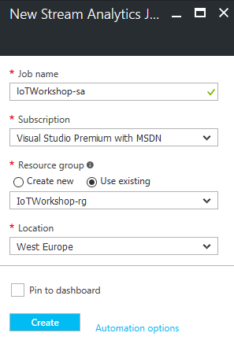

# Handling The Things Network telemetry in Azure

This is an example of how uplink messages from The Things Network can be handled in Azure. In this workshop you will pass telemetry to Azure Stream Analytics and Azure Functions. To connect Azure Stream Analytics with Azure Functions, you will add an Azure Event Hub too.

*Note: This workshop has an open end. It provides a solid solution on how to handled telemetry programmatically in Azure. From there on it's up to you to add more Azure services.*

### Prerequisites

1. A running TTN node connected to the TTN network
2. Azure account [create here](https://azure.microsoft.com/en-us/free/) _(Azure passes will be present for those who have no Azure account)_
3. An Azure IoT Hub
4. A running TTN bridge on your PC and connected to an IoT Hub
5. A running Device Explorer, connected to the IoT Hub, showing the telemetry comming in

## Create Azure Stream Analytics Job

Follow these steps to create an Azure Stream Analytics Job which takes messages from your IoT Hub. These jobs can handle great amounts of messages and handled with a SQL-like query language. Stream Analytics Jobs are great for time window related queries.

*Note: in this workshop we will not dive too deep into Stream Analytics. See for [more information](https://azure.microsoft.com/en-us/documentation/articles/stream-analytics-real-time-event-processing-reference-architecture/).*

1. Log into the [Azure portal](https://portal.azure.com/). You will be asked to provide Azure credentials if needed
2. On the left, select `Resource groups`. A List of resource groups is shown

    

3. Select the ResourceGroup `TechDays42rg`. It will open a new blade with all resources
4. Press Select `Add`. A list with available services appears

    

5. Filter it with `Stream Analytics` and select `Stream Analytics job`

    

6. An introduction will be shown. Select `Create`

    

7. A dialog for a new Stream Analytics is shown. Enter a unique name eg. `Create`. A green sign will be shown if the name is unique
8. The Resource Group eg. `TechDays42rg` is already filled in
9. Select `West Europe` for the location

    

10. Select `Create` and the portal will start creating the service. Once it is created, a notification is shown. 

Creating an Azure Stream analytics job will take some time. The input is already known, the already existing IoT Hub, So let's create the service to send the output to, an azure Event Hub.

## Create an Azure Event Hub

## Starting the Azure Stream Analytics

## Create an Azure Function

