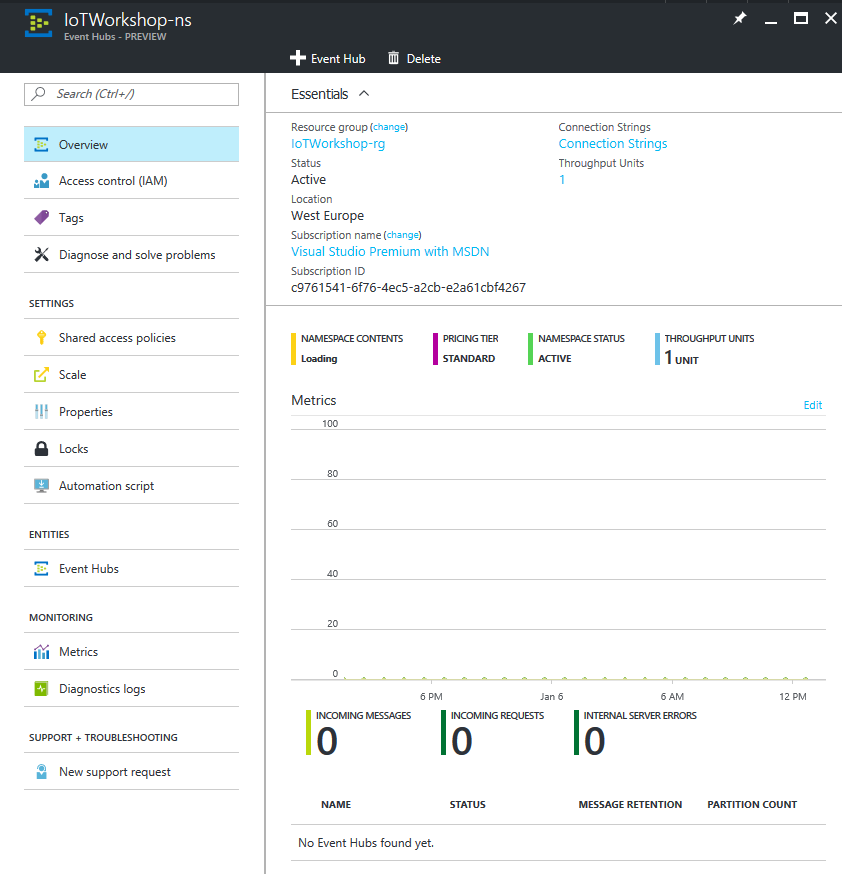
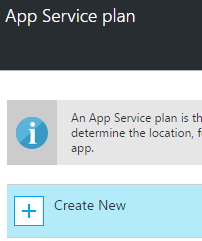
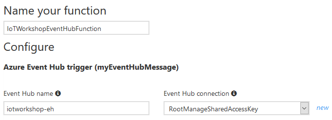

# Handling The Things Network telemetry in Azure

This is an example of how uplink messages from The Things Network can be handled in Azure. In this workshop we will pass telemetry of your device to Azure Functions. 


To connect to Azure Functions, you will add an Azure Stream Analytics job and Azure Event Hub too.

*Note: This workshop has an open ending. It provides a solid solution on how to handled telemetry programmatically in Azure. From there on it's up to you to add more Azure services.*

### Prerequisites

1. A running TTN node connected to the TTN network
2. Azure account [create here](https://azure.microsoft.com/en-us/free/) _(Azure passes will be present for those who have no Azure account)_
3. An Azure IoT Hub
4. A running TTN bridge on your PC and connected to an IoT Hub
5. A running Device Explorer, connected to the IoT Hub, showing the telemetry comming in

## Create Azure Stream Analytics job

Follow these steps to create an Azure Stream Analytics job which takes messages from your IoT Hub. These jobs can handle great amounts of messages, executing a SQL-like query. Stream Analytics Jobs are great for time window related queries.

*Note: in this workshop we will not dive too deep into Stream Analytics. See for [more information](https://azure.microsoft.com/en-us/documentation/articles/stream-analytics-real-time-event-processing-reference-architecture/).*

1. Log into the [Azure portal](https://portal.azure.com/). You will be asked to provide Azure credentials if needed
2. On the left, select `Resource groups`. A list of resource groups is shown

    

3. Select the ResourceGroup `TechDays42rg`. It will open a new blade with all resources in this group
4. Select `Add`. A list with available services appears

    

5. Filter it with `Stream Analytics` and select `Stream Analytics job`

    

6. An introduction will be shown. Select `Create`

    

7. A dialog for a new Stream Analytics job is shown. Enter a unique name eg. `TechDays42sa`. A green sign will be shown if the name is unique
8. The Resource Group eg. `TechDays42rg` is already filled in
9. Select `West Europe` for the location

    

10. Select `Create` and the portal will start creating the service. Once it is created, a notification is shown

Creating an Azure Stream analytics job will take some time. Input is already known, the already existing IoT Hub; so let's create the service to send the output to, an azure Event Hub.

## Create an Azure Event Hub

Follow these steps to create an Azure Event Hub which passes large amounts of events to other services.

1. On the left, select `Resource groups`. A list of resource groups is shown

    

2. Select the ResourceGroup `TechDays42rg`. It will open a new blade with all resources in this group
3. Select `Add`. A list with available services appears

    

4. Filter it with `Event Hubs` and select `Event Hubs`

    

5. An introduction will be shown. Select `Create`
6. Event Hubs live within namespaces. So first a new namespace must be created
7. A dialog for the new namespace is shown
8. Enter a unique namespace name eg. `TechDays42ns`. A green sign will be shown if the name is unique
9. The Resource Group eg. `TechDays42rg` is already filled in
10. Select `West Europe` for the location

    

11. Select `Create`
12. The creation will *fail* for now because the pricing tier is not entered yet. Click the `pricing tier` selection. A 'Choose your pricing tier' section will be shown. Select the Basic or Standard tier and press `select`

    

13. Select `Create` again and the portal will start creating the namespace. Once it is created, a notification is shown
14. Creating a namespace will take some time, but we want to complete this step
15. So navigate back to the resource group (repeate step 1 and 2) and check the namespace creation in the resource group
16. If the namespace becomes listed, select it. Otherwise, refresh the list a few times
17. You are now in the namespace blade. It should be shown like this, with all information available (otherwise, refresh a few times):

    

18. At the top, select `Add Event Hub`

    

19. A dialog for a new Event Hub is shown. Enter a unique name eg. `TechDays42eh`. A green sign will be shown if the name is unique *Note: the name will automatically revert to lower case!*
20. Select `Create` again and the portal will start creating the namespace. Once it is created, a notification is shown

The Event Hub is now created. But before we leave this namespace, we need some secrets for later usage.

## Azure Event Hub secrets

A few steps below we will create an Azure Functions triggered by an Event Hub. At this moment, in the editor of the Azure portal, the Azure functions can not autmatically connect to an Event Hub. We need some secrets to do it by hand.

1. Within the namespace blade, select the general setting `Share access policies`
2. select the `RootManageSharedAccessKey` policy

    

3. **Remember** the Connection string `Connection String-Primary Key`
4. **Remember** the `name` of the Event Hub eg. `techdays42eh` *Note: in lower case*

*Note: The Event Hub itself has Shared access policies too. We do not need to remember those, just the one of the policy of the namespace!.*

### Connecting the hubs to Azure Stream Analytics job input and output

As shown above, the Azure Stream Analytics job will connect the IoT Hub and the Event Hub. Both are created now. Follow these steps to define the input and the output of Azure Stream Analytics.

1. On the left, select `Resource groups`. A list of resource groups is shown

    

2. Select the ResourceGroup `TechDays42rg`. It will open a new blade with all resources in this group
3. Select the Azure Stream Analytics job `TechDays42sa`. At this moment there are no Inputs or Outputs.

    

4. Select `Inputs`
5. Select `Add`. A dialog to add a new input is shown

    

6. Enter `hubinput` as Input alias
7. Select `IoT Hub` as Source. Because we have only one IoT Hub in our account, all other fields are automatically filled in with the right IoT Hub, `TechDays42rg`

    

8. Select `Create`
9. The input will be created and the connection to the hub is tested automatically. 
10. Select `Outputs`
11. Select `Add`. A dialog to add a new output is shown

    

12. Enter `huboutput` as Output alias
13. The `Event Hub` is already selected as Source and all other fields are automatically filled in with the right Event Hub, `techdays42eh` *Note: in lower case*

    

14. Select `Create`
15. The Output will be created and the connection to the hub is tested automatically. 

The input and output are now defined. Let's add the Azure Stream Analytics job query.

### Write the Azure Stream Analytics job query

Follow these steps to write the query of Azure Stream Analytics job.

1. Select `Query`
2. A new blade is shown. Here you can write your SQL-like Azure Stream Analytics job query

    

3. Write the following, very simple, query

    ```sql
    SELECT
        CAST(water as float) as water,
        CAST(light as float) as lumen
    INTO
        huboutput 
    FROM
        hubinput
    ```

4. Press `Save`. Confirm if needed

    

5. Close the blade with the `cross` or select `TechDays42sa` in the bread crumps in the top of the page

    

6. Now the Azure Stream Analytics job has both inputs, outputs and a query

    

7. Select `Start` 

    

8. An Azure Stream Analytics job can start with telemetry from the past (if you want to rerun historical telemetry still stored in the input) or you can start with new telemetry. Select `Now` 

    

9. Select `Start` 

Starting an Azure Stream Analytics job will take some time. After starting, all telemetry from the IoT Hub will be passed on to the Event Hub. And that telemetry will each time trigger an Azure Function.

*Note: This is the simplest example of Stream Analytics usage. More indept usage is described [here](https://azure.microsoft.com/en-us/documentation/articles/stream-analytics-real-time-event-processing-reference-architecture/).*

## Create an Azure Function App 

Follow these steps to create an Azure Function App. An Azure function is actually a real function, a couple of lines of code, which is triggered by certain events and it can output the result of the code to other services. Azure Functions run 'serverless': you just write and upload your code and only pay for the number of times it is executed, the compute time and the amount of memory used. Our Azure Function will be triggered by a new event in the Event Hub. The Azure Function app is the container of Azure Functions.

1. On the left, select `Resource groups`. A list of resource groups is shown

    

2. Select the ResourceGroup `TechDays42rg`. It will open a new blade with all resources in this group
3. Select `Add`. A list with available services appears

    

4. Filter it with `Function App` and select `Function App`

    

5. An introduction will be shown. Select `Create` and you will be asked to enter the information needed to create an Azure Function

    

6. Enter a unique App name eg. `TechDays42fa`. A green sign will be shown if the name is unique
7. The Resource Group eg. `TechDays42rg` is already filled in
8. An App Service plan is the container for your app. The already created App Service Plan will probably not fit our needs. We create a new one
9. Open de App Service plan blade and select `Create New`

    

10. Enter a unique App name eg. `TechDays42asp`. A green sign will be shown if the name is unique
11. Select `West Europe` for the location

    

13. The Pricing tier will be left unaltered
12. Select `Ok`
13. Our new App Service plan is now added to the Azure Function App
14. We also want to give the Storage Account a more meaningful name. In this storage account, the function source code etc. will be stored
15. Open de Storage Account blade and select `Create New`

    

16. Enter a unique App name eg. `techdays42storage`. A green sign will be shown if the name is unique *Note: Storage account names must be all lower case!.*
17. Select `West Europe` for the location

    

18. Select `Ok`
19. Our new Storage Account is now added to the Azure Function App

    

20. Select `Create` 

The portal will start creating the Function app. Once it is created, a notification is shown.


## Create an Azure Function triggered by Event Hub

Follow these steps to create an Azure Function, triggered by the Event Hub, inside the Azure Function App. 

1. On the left, select `All resources`. A list of all resources is shown. If the Function App is not shown yet, refresh the list

    

2. Select the `TechDays42fa`. The Function app resource will be shown in a new blade. *Note: Function App is quit new in the Azure portal and the interface frequently updated. Check the Function app settings if you want to know the current version.*
3. In the new blade you are invited to get started quickly with a premade function. We will not do that :-)
4. On the left, select `New Function`

    

5. Azure Functions are triggered by events in Azure. At this moment there are 50+ C#, Python, Powershell, Bash and Node triggers. Select the `EventHubTrigger - C#`

    

6. At the bottom you have to fill in the name of the function. Change `EventHubTriggerCSharp1` into `TechDaysEventHubTriggerFunction`
7. In the file Event Hubname you will have to pass the *remembered* name of the Event Hub eg. `techdays42eh` *Note: in lower case.*
8. The Event Hub connection can be entered by pressing the `new` link
9. In the new blade, press `Add a connection string`

    

10. In a new blade, enter the connection name eg. `RootManageSharedAccessKey`. A green sign will be shown if the name is correct
11. In the Connection string filed you will have to pass the *remembered* `Connection String-Primary Key` of the Event Hub namespace connection string. A green sign will be shown if the name is correct

    

12. Select `OK`
13. The Connection string is now entered in the right field

    

14. Select `Create`

    

15. The function and trigger are saved. The develop blad is shown. In the middle, you will see the function in the 'Code' panel. The 'Logs' panel works like a trace log. 
16. Change the code a bit, change the string in the log.Info() call eg.

    ```
    using System;
    
    public static void Run(string myEventHubMessage, TraceWriter log)
    {
        log.Info($"My first TechDays C# Event Hub trigger function processed a message: {myEventHubMessage}");
    }
    ```

17. Select `Save`. In the 'Logs' panel the outcome om the compilation is shown

    ```
    2016-09-25T12:23:35.380 Script for function 'TechDaysEventHubTriggerFunction' changed. Reloading.
    2016-09-25T12:23:35.427 Compilation succeeded.
    ```

This completes the Azure function and trigger.

## Receiving telemetry in the Azure Function

By now, the full chain is set up. Telemetry from The Things Network is passed by the bridge to the Azure IoT Hub. Azure Stream Analytics passes 'the telemetry to the Azure Function using an Azure Event Hub. So by now, the telemetry will start arriving in the 'Logs' panel.

```
2016-09-25T12:30:26.576 Function started (Id=9a22c084-8116-4eed-954f-e484f52d4ce4)
2016-09-25T12:30:26.576 My first TechDays C# Event Hub trigger function processed a message: {"water":19.0,"lumen":913.0}
2016-09-25T12:30:26.576 Function completed (Success, Id=9a22c084-8116-4eed-954f-e484f52d4ce4)
2016-09-25T12:30:39.125 Function started (Id=3afa8eb2-2737-4c8d-869e-910d746c4a1e)
2016-09-25T12:30:39.125 My first TechDays C# Event Hub trigger function processed a message: {"water":14.0,"lumen":148.0}
2016-09-25T12:30:39.125 Function completed (Success, Id=3afa8eb2-2737-4c8d-869e-910d746c4a1e)
```

This completes this part workshop, handling telemetry in Azure. 

You are now ready to do something exciting with this telemetry. One example is available at [Getting started with Flow](Flow.md)

