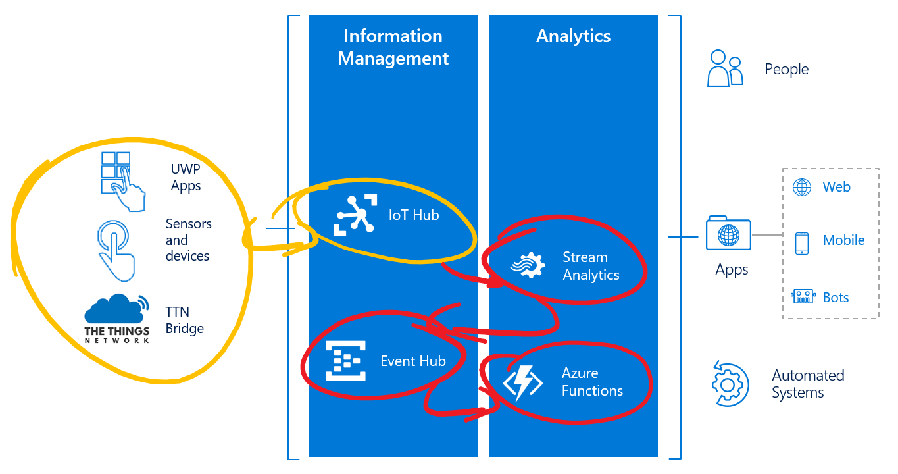
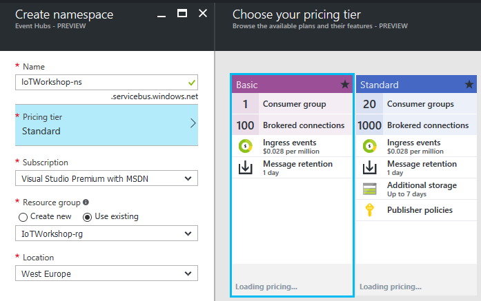
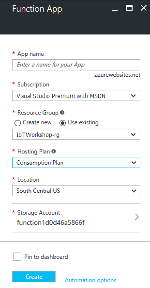
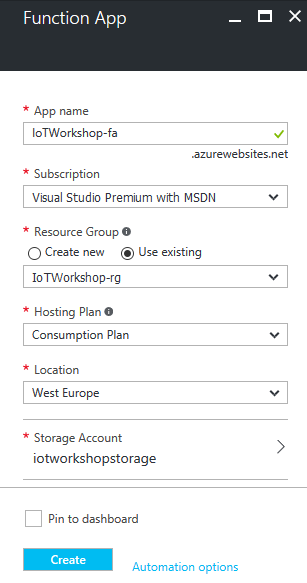
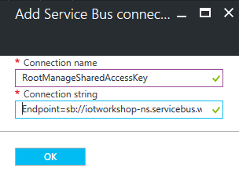

# The Things Network & Azure IoT in unison
## Handling The Things Network telemetry in Azure

This is an example of how uplink messages from The Things Network can be handled in Azure. In this workshop, we will pass telemetry of your device to Azure Functions. 



Before connecting to Azure Functions, you will first add an Azure Stream Analytics job and Azure Event Hub.

*Note: In this workshop, we will create uniquely named Azure resources. The suggested names could be reserved already.*

### Prerequisites

1. A running TTN node connected to the TTN network
2. Azure account [create here](https://azure.microsoft.com/en-us/free/) _(Azure passes will be present for those who have no Azure account)_
3. An Azure IoT Hub
4. A running TTN bridge on your PC and connected to an IoT Hub
5. A running Device Explorer or IoT Hub Explorer, connected to the IoT Hub, showing the telemetry coming in

## Create Azure Stream Analytics job


Follow these steps to create an Azure Stream Analytics job which takes messages from your IoT Hub. These jobs can handle great amounts of messages, executing an SQL-like query. Stream Analytics Jobs are great for time window related queries.

*Note: in this workshop, we will not dive too deep into Stream Analytics. See for [more information](https://azure.microsoft.com/en-us/documentation/articles/stream-analytics-real-time-event-processing-reference-architecture/).*

1. `Log into` the [Azure portal](https://portal.azure.com/). You will be asked to provide Azure credentials if needed
2. On the left, select `Resource groups`. A list of resource groups is shown

    

3. Select the ResourceGroup `TechDays42rg`. It will open a new blade with all resources in this group
4. Select `Add`. A list of available services appears

    

5. Filter it with `Stream Analytics` and select `Stream Analytics job`

    

6. An introduction will be shown. Select `Create`

    

7. A dialog for a new Stream Analytics job is shown. Enter a unique name eg. `TechDays42sa`. A green sign will be shown if the name is unique
8. The Resource Group eg. `TechDays42rg` is already filled in
9. Select `West Europe` for the location

    

10. Select `Create` and the portal will start creating the service. Once it is created, a notification is shown

Creating an Azure Stream analytics job will take some time. Input is already known, the already existing IoT Hub; so let's create the service to send the output to, an azure Event Hub.

## Create an Azure Event Hub

Follow these steps to create an Azure Event Hub which passes large amounts of events to other services.

1. On the left, select `Resource groups`. A list of resource groups is shown

    

2. Select the ResourceGroup `TechDays42rg`. It will open a new blade with all resources in this group
3. Select `Add`. A list of available services appears

    

4. Filter it with `Event Hubs` and select `Event Hubs`

    

5. An introduction will be shown. Select `Create`
6. Event Hubs live within namespaces. So first a new namespace must be created
7. A dialog for the new namespace is shown
8. Enter a unique namespace name eg. `TechDays42ns`. A green sign will be shown if the name is unique
9. Select a pricing tier. Select the `pricing tier` selection. A 'Choose your pricing tier' section will be shown. Select the `Basic tier` or `Standard tier` and press `select`

    

10. The Resource Group eg. `TechDays42rg` is already filled in
11. Select `West Europe` for the location

    

12. Select `Create` and the portal will start creating the namespace. Once it is created, a notification is shown
13. Creating a namespace will take some time, but we want to complete this step
14. So navigate back to the resource group (repeat step 1 and 2) and check the namespace creation in the resource group
15. If the namespace becomes listed, select `TechDays42ns`. Otherwise, 'refresh' the list a few times

    

16. You are now in the namespace blade. It should be shown like this, with all information available (otherwise, refresh a few times):

    

17. At the top, select `Add Event Hub`

    

18. A dialog for a new Event Hub is shown. Enter a unique name eg. `TechDays42eh`. A green sign will be shown if the name is unique *Note: the name will be reverted to lower case when the Event Hub is created!*
19. Select `Create` and the portal will start creating the Event Hub. Once it is created, a notification is shown

The Event Hub is now created. But before we leave the namespace it is created in, we need some secrets for later usage.

## Azure Event Hub secrets

A few steps below we will create an Azure Functions triggered by an Event Hub. At this moment, in the editor of the Azure portal, the Azure functions can not automatically connect to an Event Hub. We need some secrets to do it by hand.

1. Within the namespace blade, select the general setting `Shared access policies`
2. select the `RootManageSharedAccessKey` policy

    

3. **Write down** the Connection string `Connection String-Primary Key`
4. **Write down** the `name` of the Event Hub eg. `techdays42eh` *Note: in lower case*

*Note: The Event Hub itself has Shared access policies too. We do not need to remember those, just the one of the policy of the namespace!.*

### Connecting the hubs to Azure Stream Analytics job input and output

As shown above, the Azure Stream Analytics job will connect the IoT Hub and the Event Hub. Both are created now. Follow these steps to define the input and the output of Azure Stream Analytics.

1. On the left, select `Resource groups`. A list of resource groups is shown

    

2. Select the ResourceGroup `TechDays42rg`. It will open a new blade with all resources in this group
3. Select the Azure Stream Analytics job `TechDays42sa`. At this moment there are no Inputs or Outputs.

    

4. Select `Inputs`
5. Select `Add`. A dialog to add a new input is shown

    

6. Enter `hubinput` as Input alias
7. Select `IoT Hub` as Source. Because we have only one IoT Hub in our account, all other fields are automatically filled in with the right IoT Hub, `TechDays42ih`

    

8. Select `Create`
9. The input will be created and the connection to the hub is tested automatically. 
10. Select `Outputs`
11. Select `Add`. A dialog to add a new output is shown

    

12. Enter `huboutput` as Output alias
13. The `Event Hub` is already selected as Sink and all other fields are automatically filled in with the right Event Hub, `techdays42eh` *Note: in lower case*

    

14. Select `Create`
15. The Output will be created and the connection to the hub is tested automatically. 

The input and output are now defined. Let's add the Azure Stream Analytics job query.

### Write the Azure Stream Analytics job query

Follow these steps to write the query of Azure Stream Analytics job.

1. Select `Query`
2. A new blade is shown. Here you can write your SQL-like Azure Stream Analytics job query

    

3. Write the following, very simple, query

    ```sql
    SELECT
        CAST(waterLevel as bigint) as level,
        EventProcessedUtcTime as time,
        IoTHub.ConnectionDeviceId as deviceId
    INTO
        huboutput 
    FROM
        hubinput
    ```

4. Press `Save`. Confirm if needed

    

5. Close the Query blade with the `close icon` or select `TechDays42sa` in the bread crumbs in the top of the page

    

6. Now the Azure Stream Analytics job has both inputs, outputs and a query

    

7. Select `Start` 

    

8. An Azure Stream Analytics job can start with telemetry from the past (if you want to rerun historical telemetry still stored in the input) or you can start with new telemetry. Select `Now` 

    

9. Select `Start` 

Starting an Azure Stream Analytics job will take some time. After starting, all telemetry from the IoT Hub will be passed on to the Event Hub. And that telemetry will each time trigger an Azure Function.

*Note: This is the simplest example of Stream Analytics usage. More in-depth usage is described [here](https://azure.microsoft.com/en-us/documentation/articles/stream-analytics-real-time-event-processing-reference-architecture/).*

## Create an Azure Function App 


Follow these steps to create an Azure Function App. An Azure function is actually a real function, a couple of lines of code, which is triggered by certain events and it can output the result of the code to other services. Azure Functions run 'serverless': you just write and upload your code and only pay for the number of times it is executed, the compute time and the amount of memory used. Our Azure Function will be triggered by a new event in the Event Hub. The Azure Function app is the container of Azure Functions.

1. On the left, select `Resource groups`. A list of resource groups is shown

    

2. Select the ResourceGroup `TechDays42rg`. It will open a new blade with all resources in this group
3. Select `Add`. A list of available services appears

    

4. Filter it with `Function App` and select `Function App`

    

5. An introduction will be shown. Select `Create`

    

6.  You will be asked to enter the information needed to create an Azure Function

    

7. Enter a unique App name eg. `TechDays42fa`. A green sign will be shown if the name is unique
8. The Resource Group eg. `TechDays42rg` is already filled in
9. An App Service plan is the container for your app. The already created App Service Plan will probably not fit our needs. We create a new one
10. Open the App Service plan blade and select `Create New`

    

11. Enter a unique App name eg. `TechDays42asp`. A green sign will be shown if the name is unique
12. Select `West Europe` for the location

    

13. The Pricing tier will be left unaltered
14. Select `Ok`
15. Our new App Service plan is now added to the Azure Function App
16. We also want to give the Storage Account a more meaningful name. In this storage account, the function source code etc. will be stored
17. Open de Storage Account blade and select `Create New`

    

18. Enter a unique App name eg. `techdays42storage`. A green sign will be shown if the name is unique *Note: Storage account names must be all lower case!.*

    

19. Select `Ok`
20. Our new Storage Account is now added to the Azure Function App

    

21. Select `Create` 

The portal will start creating the Function app. Once it is created, a notification is shown.


## Create an Azure Function triggered by Event Hub

Follow these steps to create an Azure Function, triggered by the Event Hub, inside the Azure Function App. 

1. On the left, select `Resource groups`. A list of resource groups is shown

    

2. Select the ResourceGroup `TechDays42rg`. It will open a new blade with all resources in this group
3. Select the Azure Function App `TechDays42fa`
4. If the Function App is not shown yet, `refresh` the list. The Function app resource will be shown in a new blade

    

5. Function Apps are quite new in the Azure portal and the interface is still frequently updated. Check the Function app settings if you want to know the current version.
6. If you are requested to update the Function App, select `Update`

    

7. Select `Quickstart`

    

8. You will be invited to get started quickly with a premade function. We will create our own custom function. Select at the bottom `Or create your own custom function`

    

9. Azure Functions are triggered by events in Azure. A list of possible triggers is shown. At this moment there are 50+ C#, Python, Powershell, Bash and Node triggers. Select the `EventHubTrigger - C#`

    

10. At the bottom of the page (use the scrollbar of the page), you have to fill in the field 'Name your function'. Change `EventHubTriggerCSharp1` into `TechDaysEventHubTriggerFunction`
11. In the field 'Event Hub name' you will have to pass the *remembered* name of the Event Hub eg. `techdays42eh` *Note: in lower case*
12. The 'Event Hub connection' field can be filled by pressing the `new` link
13. A blade with an empty list of connection strings will be shown. Press `Add a connection string`

    

14. In a new blade, enter some name in the 'Connection name' field eg. `RootManageSharedAccessKey`. A green sign will be shown if the name is correct
15. In the 'Connection string' field you will have to pass the *remembered* `Connection String-Primary Key` of the Event Hub namespace connection string. A green sign will be shown if the name is correct

    

16. Select `OK`
17. The Connection string is now entered in the right field

    

18. Select `Create`

    

19. The function and trigger are saved. The develop page is shown. In the middle, you will see the function in the 'Code' panel. The 'Logs' panel works like a trace log. 
20. Update the code a bit, change the string in the log.Info() call eg.

    ```csharp
    using System;
    
    public static void Run(string myEventHubMessage, TraceWriter log)
    {
        log.Info($"My TechDays trigger function processed this message: {myEventHubMessage}");
    }
    ```

21. Select `Save`. The changed C# code will be recompiled immediately
22. In the 'Logs' panel, just below 'Code', `verify the outcome` of the compilation

    ```
    2016-09-25T12:23:35.380 Script for function 'TechDaysEventHubTriggerFunction' changed. Reloading.
    2016-09-25T12:23:35.427 Compilation succeeded.
    ```

This completes the Azure function and trigger.

## Receiving telemetry in the Azure Function

By now, the full chain of Azure services is set up. Telemetry from The Things Network is passed by the bridge to the Azure IoT Hub (as seen in one of the two explorers). Azure Stream Analytics passes 'the telemetry to the Azure Function using an Azure Event Hub. So by now, the telemetry will start arriving in the 'Logs' panel.

```
2016-09-25T14:58:56.659 Function started (Id=44cf8082-b355-47a1-a220-260e23679eb7)
2016-09-25T14:58:56.659 My TechDays trigger function processed this message: {"level":16,"time":"2016-09-25T14:58:52.1818540Z","deviceId":"goatTrough"}
2016-09-25T14:58:56.659 Function completed (Success, Id=44cf8082-b355-47a1-a220-260e23679eb7)
2016-09-25T14:59:12.157 Function started (Id=8e617e92-6492-439a-8d2d-d324694a55a4)
2016-09-25T14:59:12.157 My TechDays trigger function processed this message: {"level":23,"time":"2016-09-25T14:59:08.1899979Z","deviceId":"goatTrough"}
2016-09-25T14:59:12.157 Function completed (Success, Id=8e617e92-6492-439a-8d2d-d324694a55a4)
```

Notice that we have full control over telemetry. We know which device has sent data at what time. This is great for charts or commands.

Receiving telemetry in Azure completes this part of the workshop. You are now ready to do something exciting with this telemetry. One example is available at [Pushing telemetry messages to Microsoft Flow and beyond](Flow.md)

