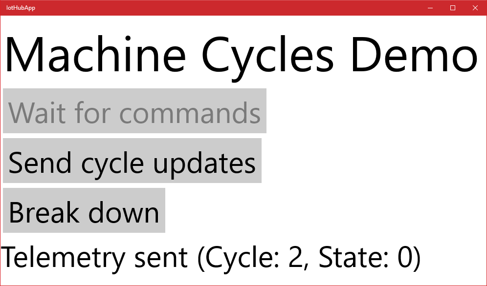

# The Things Network & Azure IoT in unison
## Passing commands back to a device

This is an example of how downlink commands are sent back to a device. In this workshop, we will send commands back to faulty devices, using an Azure Function, to start them up again. 


This example connects to the [UWP app](UwpToIotHub.md).

*Note: In this workshop, we will create uniquely named Azure resources. The suggested names could be reserved already.*

### Prerequisites

1. Azure account [create here](https://azure.microsoft.com/en-us/free/) _(Azure passes will be present for those who have no Azure account)_
2. A running TTN node connected to the TTN network and a running TTN bridge on your PC and connected to an IoT Hub
3. or... a UWP app which simulates a machine running duty cycles
4. A combination of Azure IoT Hub, Stream Analytics job, Event Hub and Azure Function which are waiting for analysed telemetry coming from the devices
5. A running Device Explorer or IoT Hub Explorer, connected to the IoT Hub, showing the telemetry coming in

### Steps to perform in this part of the workshop

At the end of this part of the workshop, the following steps are performed

1. Creating commands to send back
2. Handle commands in the devices

## Creating commands for devices which are in a faulty state

In the [previous workshop](Azure.md) we passed the telemetry from the device to an Stream Analytics job. This job collected devices which are sending error states. Every minute, information about devices that are in a faulty state are passed to an Azure Function.

In this workshop we will react on these devices by sending them a command to 'repair themself'. 

### Updating the Azure Function with sending command logic

First we update the Azure Function. For each devices which is passed on, we send a command back.

Sending commands back to devices is a specific feature of the IoT Hub. The IoT Hub registers devices and thier security policies. And the Iot Hub has build-in logic to send commands back.

1. On the left, select `Resource groups`. A list of resource groups is shown

    

2. Select the ResourceGroup `IoTWorkshop-rg`. It will open a new blade with all resources in this group
3. Select the Azure Function App `IoTWorkshop-fa`
4. To the left, the currenct functions are shown. Select `IoTWorkshopEventHubFunction`

    

5. The Code panel is shown. The code of the function is shown. *Note: this code is saved in a file named run.scx*
6. Change the current code into

    ```csharp
    using System;
    using Microsoft.Azure.Devices;
    using System.Text;
    using Newtonsoft.Json; 

    public static void Run(string myEventHubMessage, TraceWriter log)
    {
      log.Info($"Stream Analytics produced {myEventHubMessage}");  

      // Connect to IoT Hub   
      var connectionString = "[IOT HUB connection string]";
      var serviceClient = ServiceClient.CreateFromConnectionString(connectionString);
    
      // Send commands to all devices 
      var messages = JsonConvert.DeserializeObject<StreamAnalyticsCommand[]>(myEventHubMessage);

      log.Info($"{messages.Length} messages arrived.");

      foreach(var message in messages)
      {
        var bytes= new byte[1];
        bytes[0] = 42; // restart the machine!
        var commandMessage = new Message(bytes);
        serviceClient.SendAsync(message.deviceid, commandMessage);

        // Log
        log.Info($"Machine restart command processed after {message.count} errors for {message.deviceid}");
      }
    }

    public class StreamAnalyticsCommand
    {
      public string deviceid {get; set;}
      public int count {get; set;}
    }
    ```

7. Press the `Logs` button to open the pane which shows some basic logging

    

8. A 'Logs' panel is shown. This 'Logs' panel works like a trace log.
9. If you try to run this code, you will notice that compilation fails. This is not that surprising: we are using certain libraries that Azure Functions has no knowledge of. Yet!
10. Press the `View Files` button to open the pane which shows a directory tree of all files.

    

11. In the pane you can see that the file currently selected is: run.csx

    

12. Add a new file by pressing `Add`

    

13. Name the new file `project.json`

    

14. Press `Enter` to confirm the name of the file and an empty code editor will be shown for this file.
15. The Project.json file describes which nuget packages have to be references. Fill the editor with the following code 

    ```json
    {
      "frameworks": {
        "net46": {
          "dependencies": {
            "Microsoft.AspNet.WebApi.Client": "5.2.3",
            "Microsoft.AspNet.WebApi.Core": "5.2.3",
            "Microsoft.Azure.Amqp": "1.1.5",
            "Microsoft.Azure.Devices": "1.1.0",
            "Newtonsoft.Json": "9.0.1"
          }
        }
      }
    }
    ```

16. Select `Save`. The changed C# code will be recompiled immediately *Note: you can press 'save and run', this will actually run the function, but an empty test will passed (check out the 'Test' option to the right for more info)*
17. In the 'Logs' panel, just below 'Code', `verify the outcome` of the compilation

    ```
    2017-01-08T14:49:46.794 Packages restored.
    2017-01-08T14:49:47.113 Script for function 'IoTWorkshopEventHubFunction' changed. Reloading.
    2017-01-08T14:49:47.504 Compilation succeeded.
    ```

18. There is just one thing left to do: we have to fill in the Azure IoT Hub security policy connection string. To send commands back, we have to proof we are authorized to do this
19. In the Azure Function, replace '[IOT HUB connection string]' your *remembered* IoT Hub `Connection String-primary key`
20. Recompile again succesfully

At this moment the Azure Function is ready to receive data about devices which simulate 'faulty machines'. And it can send commands back to 'repair' the 'machines'.

## Handle commands in the devices


Let's bring a device in a faulty state and see how the Azure IoT Platforms sends back a command to repair it.

You can work with TTN devices or with the UWP app which simulates a device.

### Handle commands in the TTN Node

### Handle commands in an UWP app

At this moment your [UWP app](UwpToIotHub.md) should already been build. Let's send some telemetry

1. Restart the UWP app, press `Send cycle updates` a couple of times

    

2. The cycles are normal behavior. And these will not be picked up by the Stream Analytics job
3. To receive commands, we have to wait for them to be received from the IoT Hub. Press `Wait for commands` *note: the communcation with the IoT Hub is based on a communcation protocol named AMQP by default. This makes communcation very efficient, we are not polling every few seconds and thus saving band width*

    

4. Now we 'break' the machine by pressing `Break down`. *Note: the title will be shown in a red color*

    

5. finally, we send telemetry, a few times to notify the Azure IoT platform (using the IoT Hub) that the machine in in a faulty state
6. In the UWP app, again press `Send cycle updates` a couple of times. Error code 99 is shown

    
 
7. The telemetry is sent to the IoTHub which passes the data to the StreamAnalytics job. If the error codes arrive multiple times within the same time frame (the hopping window is 1 minute), an event is constructed and passed to the Azure Function.
8. The Azure function will show the execution of the method

    ```
    2017-01-08T15:45:07.169 Function started (Id=91558474-1e83-4ce5-b9ca-81b87f22dff4)
    2017-01-08T15:45:07.169 Stream Analytics produced [{"count":3,"deviceid":"MachineCyclesUwp"}]
    2017-01-08T15:45:07.169 1 messages arrived.
    2017-01-08T15:45:07.169 Machine restart command processed after 3 errors for MachineCyclesUwp
    2017-01-08T15:45:07.169 Function completed (Success, Id=91558474-1e83-4ce5-b9ca-81b87f22dff4)
    ```

9. Notice that the event is actually a JSON array of messages (containing one message). And correct machine is restarted
10. Now look at the UWP app, the machine is restart, just a second or so after the command was send by the Azure Function *Note: the title is no longer red*

    
 
We have now succesfully send som telemetry which is picked up and handled. In the end, commands were received and acted on.

Receiving commands form Azure completes this part of the workshop. You are now ready to do something else, also exciting, with this telemetry. One example is available at [Pushing telemetry messages to Microsoft Flow and beyond](Flow.md)

