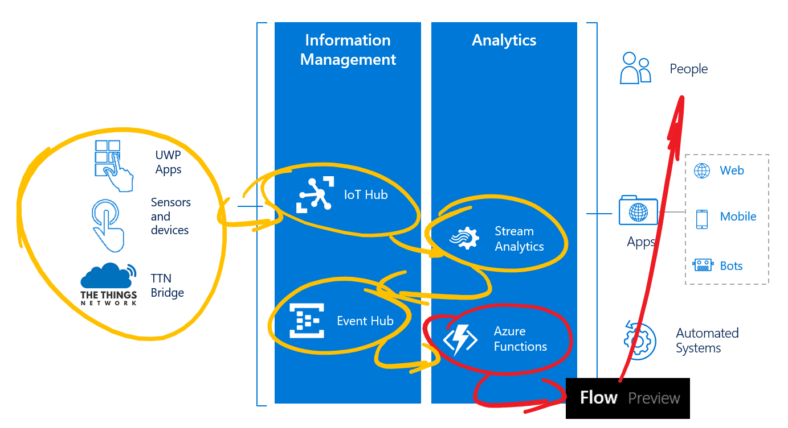

# Pushing telemetry messages to Microsoft Flow and beyond

This is an example of how messages from Azure Functions can be passed to an external service, eg. Mail, using Microsoft Flow. 

Microsoft Flow is a brand new SaaS offering, available today in preview, for automating workflows across the growing number of applications and SaaS services that business users rely on. How much time do we spend sifting through streams of messages for the few notifications that matter? How much manual labor is spent transferring information from one place to another, or entering data into tracking systems? Too often these tasks are done manually, or not done at all.

We will pass the telemetry to an email address provided by you.

*Note: in this workshop we will not dive too deep into Microsoft Flow. See for [more information](https://flow.microsoft.com/).*

### Prerequisites

1. An Azure Function written in C# to recieve telemetry from The Things Network
2. Telemetry arriving at the Azure Function
3. Azure account [create here](https://azure.microsoft.com/en-us/free/) _(Azure passes will be present for those who have no Azure account)_
4. A Microsoft account for Microsoft Flow
5. A Slack account _(optional)_
6. A Twitter account _(optional)_

## Create an endpoint in Microsoft Flow

Follow these steps to create an endpoint in Microsoft Flow to send telemetry data to. From there we can use the data in an "If Then Else" flow.

*Note: If you have no account yet, please sign up first (You can sign up for free using the button at the top of the page).*

1. `Log into` the [Microsoft flow portal](https://flow.microsoft.com/). You will be asked to provide Azure credentials if needed

    

2. Select 'Make a flow'. A lot of pre-defined flows are shown. Scroll through the list to get an impression of all combination possible.
3. Select 'My flows'

    

4. We will make a new flow from scratch

    

5. Select 'Create from blank' 

    

