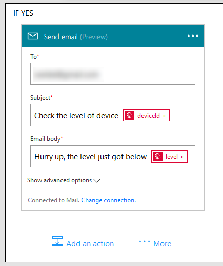

# Pushing telemetry messages to Microsoft Flow and beyond

This is an example of how messages from Azure Functions can be passed to an external service, eg. Mail, using Microsoft Flow. 

Microsoft Flow is a brand new SaaS offering, available today in preview, for automating workflows across the growing number of applications and SaaS services that business users rely on. How much time do we spend sifting through streams of messages for the few notifications that matter? How much manual labor is spent transferring information from one place to another, or entering data into tracking systems? Too often these tasks are done manually, or not done at all.

We will pass the telemetry to an email address provided by you.


*Note: in this workshop we will not dive too deep into Microsoft Flow. See for [more information](https://flow.microsoft.com/).*

### Prerequisites

1. An Azure Function written in C# to recieve telemetry from The Things Network
2. Telemetry arriving at the Azure Function
3. Azure account [create here](https://azure.microsoft.com/en-us/free/) _(Azure passes will be present for those who have no Azure account)_
4. A Microsoft account for Microsoft Flow
5. A Slack account _(optional)_
6. A Twitter account _(optional)_

## Create an endpoint in Microsoft Flow

Follow these steps to create an endpoint in Microsoft Flow to send telemetry data to. From there we can use the data in an "If Then Else" flow.

*Note: If you have no account yet, please sign up first (You can sign up for free using the button at the top of the page).*

1. `Log into` the [Microsoft flow portal](https://flow.microsoft.com/). You will be asked to provide Azure credentials if needed

    

2. Select `Make a flow`. A lot of pre-defined flows are shown. Scroll through the list to get an impression of all combination possible. We will *not* use option, we will create a flow form scratch
3. Select `My flows`

    

4. Normally, all your flows will appear here. Because there is no flow yet, a short introduction is shown

    

5. Select `Create from blank` 

    

6. An empty flow is show. You are invited to select one of the many flow steps

    

7. But first give the flow a proper name. Name it `Mail telemetry conditionally`

    

8. Then select the `Request` step. This is an incoming API call that could use actions in a Logic App or other API to trigger this flow. *Note: We will call this API from Azure Functions later on.*

    

9. We will post a Json object to the Request step. Enter this 'Request Body JSON Schema' to transform this Json object to an entity. This way, Microsoft Flow can handle the fields in the message.

    ```json
    {
      "type": "object",
      "properties": {
        "level": {
          "type": "integer"
        },
        "deviceId": {
          "type": "string"
        },
        "time": {
          "type": "string"
        }
      },
      "required": [
        "deviceId"
      ]
    }
    ```

10. This step is ready. After the creation of this flow the enpoint will be provided.
11. Select `New step`

    

12. In this flow we will mail conditionally. So select `Add a condition`

    

13. This is the hart of the Flow. We have to provide a condition (like 'Level is higher then 15'). And if it's true, a certain step will be executed. Otherwise, the other step will be executed *Note: The latter is optional.*

    

14. Enter the left field with 'Choose a value'. The previous Request step can output an entity with fields like 'deviceId', 'time' and 'level'. So here you can compare one of the field with another value. 

    

15. Select the `level` field.
16. Because we want to be warned when the level is less then a certain value, select `is less then` operator.

    

17. Finally, enter `42` in the right field

    

18. We have created a condition. Let's act to it. In the left, Change 'IF YES, DO NOTHING' into doing something by selecting `Add an Action`

    

19. Select the `Mail - Send email` step

    

20. Create a connection for Mail. `Accept` the SendGrid terms and privacy policy *Note: SendGrid is a third party email provider.*

    

21. Enter `your own email address` in the 'To' field 
22. Enter `Check the level of device ` plus the entity field 'deviceId' in the 'Subject' field 
23. Enter `Hurry up, the level just got below ` plus the entity field 'level' in the 'Email body' field 

    

24. This Mail step is ready, the flow is ready. Select `Create flow`

    

25. The flow is now being created. We have to wait a moment to get it starting up. Select `Done`

    

Although the flow is created and almost active we still need to do one thing more. By this time , the endpoint of the Request step will be created. 

## Getting the API endpoint of the Request step

Before we can pass telemetry to this flow, we need to have the API endpoint of the Request step

1. Select `My flows`

    

2. All your flows will appear here. The flow we just created will be shown

    

3. Edit the flow by selecting `the pen` icon

    

4. The flow will be show. Select the first step, the `Request step`

    

5. Once selected, the URL of the Request step endpoint is shown
6. **Write down** the Url `HTTP POST to this URL`
7. Select `X Close' to close this page. Do *not* save any changes

    

Now we have the url of the endpoint. We will call it inside the Azure Function

## Altering the azure function for Microsoft Flow access


