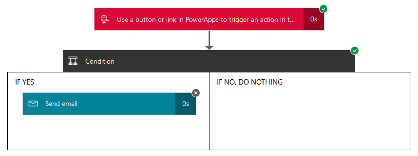
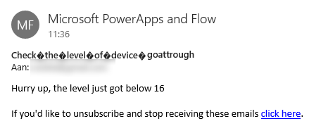
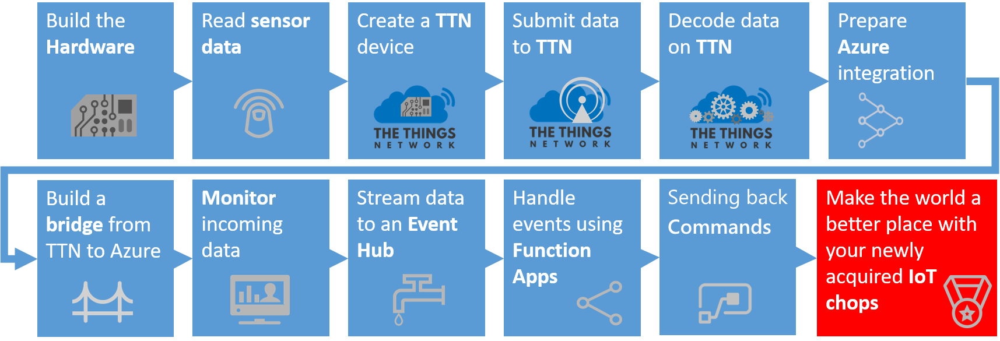

# The Things Network & Azure IoT in unison
## Pushing telemetry messages to Microsoft Flow and beyond

This is an example of how messages from Azure Functions can be passed to an external service, eg. Mail, using Microsoft Flow. 

Microsoft Flow is a brand new SaaS offering, available today in preview, for automating workflows across the growing number of applications and SaaS services that business users rely on. How much time do we spend sifting through streams of messages for the few notifications that matter? How much manual labor is spent transferring information from one place to another, or entering data into tracking systems? Too often these tasks are done manually, or not done at all.

We will pass the telemetry to an email address provided by you.

*Note: in this workshop we will not dive too deep into Microsoft Flow. See for [more information](https://flow.microsoft.com/).*

### Prerequisites

1. An Azure Function written in C# to recieve telemetry from The Things Network
2. Telemetry arriving at the Azure Function
3. Azure account [create here](https://azure.microsoft.com/en-us/free/) _(Azure passes will be present for those who have no Azure account)_
4. A Microsoft account for Microsoft Flow [signup here](https://flow.microsoft.com/)

## Create an endpoint in Microsoft Flow


Follow these steps to create an endpoint in Microsoft Flow to send telemetry data to. From there we can use the data in an "If Then Else" flow.

*Note: If you have no account yet, please sign up first (You can sign up for free using the button at the top of the page).*

1. `Log into` the [Microsoft flow portal](https://flow.microsoft.com/). You will be asked to provide Azure credentials if needed

    

2. Select `Make a flow`. A lot of pre-defined flows are shown. Scroll through the list to get an impression of all combination possible. We will *not* use option, we will create a flow form scratch
3. Select `My flows`

    

4. Normally, all your flows will appear here. Because there is no flow yet, a short introduction is shown

    

5. Select `Create from blank` 

    

6. An empty flow is shown. You are invited to select one of the many flow steps

    

7. First give the flow a proper name. Name it `Mail telemetry conditionally`

    

8. `Scroll down` until a step called 'Request' is shown

    

9. Then select the `Request` step

    

10. This is an incoming API call and we will use Azure Functions to trigger this flow. The URL will be generated after save. *Note: We will call this API from Azure Functions later on*
11. We will post a Json object to the Request step. Flow can not handle this object directly. Therefor, enter this 'Request Body JSON Schema' to transform this Json object into an entity. This way, Microsoft Flow can handle the fields in the message

    ```json
    {
      "type": "object",
      "properties": {
        "level": {
          "type": "integer"
        },
        "deviceId": {
          "type": "string"
        },
        "time": {
          "type": "string"
        }
      },
      "required": [
        "deviceId"
      ]
    }
    ```

12. The URL endpoint will be provided after the creation of this flow. So we leave it empty for now. The Request step is ready now
13. Select `New step`

    

14. In this flow we will mail conditionally. So select `Add a condition` to add that condition

    

14. This is the hart of the Flow. We have to provide a condition (like 'Level is higher then 15'). And if it's true, a certain step will be executed. Otherwise, the other step will be executed. *Note: The first or the latter are optional*

    

15. Enter the left field with 'Choose a value'. The previous Request step will output an entity with fields like 'deviceId', 'time' and 'level'. So here you can compare one of the fields with another value

    

16. Select the `level` field
17. Because we want to be warned when the level is less then a certain value, select `is less then` operator

    

18. Finally, enter `42` in the right field

    

19. We have created a condition. Let's act to it. In the left, Change the 'IF YES, DO NOTHING' block into 'IF YES' by selecting `Add an Action`

    

20. Select the `Mail - Send email` step

    

21. Create a connection for Mail. `Accept` the SendGrid terms and privacy policy *Note: SendGrid is a third party email provider*

    

22. Enter `your own email address` in the 'To' field 
23. Enter `Check the level of device ` plus the entity field 'deviceId' in the 'Subject' field 
24. Enter `Hurry up, the level just got below ` plus the entity field 'level' in the 'Email body' field 

    

25. This Mail step is ready, ans so the flow is ready. Select `Create flow`

    

26. The flow is now being created. We have to wait a moment to get it starting up. Select `Done`

    

Although the flow is created and almost active we still need to do one thing more. By this time , the endpoint of the Request step is already created. 

## Getting the API endpoint of the Request step

Before we can pass telemetry to this flow, we need to have the API endpoint of the Request step.

1. Select `My flows`

    

2. All your flows will appear here. The flow we just created will be shown

    

3. Edit the flow by selecting `the pen` icon

    

4. The flow will be show. Select the first step, the `Request step`

    

5. Once selected, the URL of the Request step endpoint is shown
6. **Copy and write down** the Url in the `HTTP POST to this URL` field
7. Select `X Close' to close this page. Do *not* save any changes

    

Now we have the url of the endpoint. We will call it inside the Azure Function.

## Altering the azure function for Microsoft Flow access

At this moment, the Azure Function is still showing the telemetry as a message in the logging. Let's make the Azure function more meaningful. Let's 'talk' to Microsoft Flow  

1. On the left, select `Resource groups`. A list of resource groups is shown

    

2. Select the ResourceGroup `TechDays42rg`. It will open a new blade with all resources in this group
3. Select the Azure Function App `TechDays42fa`
4. The develop page is shown. In the middle, you will see the function in the 'Code' panel
5. Replace 'the code'

    ```csharp
    using System;
    using System.Text;

    public static void Run(string myEventHubMessage, TraceWriter log)
    {
      log.Info($"My TechDays trigger function processed this message: {myEventHubMessage}");

      using (var client = new System.Net.Http.HttpClient())
      {

        var response = client.PostAsync(
                        "[PASTE THE REQUEST URL HERE]",
                        new StringContent(myEventHubMessage, 
                                          Encoding.UTF8,
                                          "application/json")
                                          ).Result;
        log.Info($"Microsoft Flow accepts the message: {response.IsSuccessStatusCode.ToString()}");
      }
    }
    ```

6. And `replace` '[PASTE THE REQUEST URL HERE]' with the *remembered* `HTTP POST URL`
7. Select `Save`. The changed C# code will be recompiled immediately
8. In the 'Logs' panel, just below 'Code', `verify the outcome` of the compilation

    ```
    2016-09-25T12:23:35.380 Script for function 'TechDaysEventHubTriggerFunction' changed. Reloading.
    2016-09-25T12:23:35.427 Compilation succeeded.
    ```

9. When telemetry arrives, the log shows how the message is picked up by Microsoft Flow

    ```
    2016-09-30T08:29:04.325 Function started (Id=dbd7a0c4-3710-464d-a6fe-bc32d5a856c8)
    2016-09-30T08:29:04.404 My TechDays trigger function processed this message: {"level":45,"eventprocessedutctime":"2016-09-30T08:28:59.4658651Z","connectiondeviceid":"goatTrough"}
    2016-09-30T08:29:05.252 Microsoft Flow accepts the message: True
    2016-09-30T08:29:05.252 Function completed (Success, Id=dbd7a0c4-3710-464d-a6fe-bc32d5a856c8)
    ```

Now the Azure Function is passing the telemetry towards your Microsoft Flow.

## Receiving mail from your device

Microsoft Flow is passing the telemetry to the email address you provided. 

1. Microsoft flow provides a list of runs. We can check how our flow is doing
2. Go to the Microsoft flow portal
3. Select `My flows`

    

4. All your flows will appear here. The flow we created will be shown

    

5. Select the run list of the flow by selecting `the i` (for Information) icon

    

6. By now, one or more runs must be listed

    

7. Select a row and `click' on it
8. The flow will be shown. Green ticks will mark which steps are executed. In this example, the telemetry is received, the condition is checked but the 'IF NO, DO NOTHING' block is executed (the 'IF YES' block has no green tick)

    

9. But is the condition is right, the level is too low, both steps will have a green tick

    

10. Finally, open an email client and check your mail. Did you receive any mail?
11. The mail is only sent conditionally when the level is too low. You will receive an email message like this

    

Now we get email from a TTN device. You are free to play with flow. You can alter the condition or you can add more steps to sent the telemetry to. 

This concludes this part of the workshop. Thank you for checking this out. You have now acquired your IoT chops!



