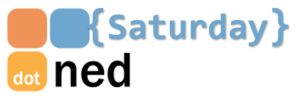

# The Things Network & Azure IoT: a perfect combination
## DotNed Saturday 2017 - IoT Workshop

This workshop is all about you, getting your hands on some amazing pieces of technology. 

First, you will be introduced to The Things Network (the first ever, community-powered, global IoT network). Start building a solution that collects sensor information using a device with an enormous wireless range potential at extremely low power consumption. 

Next, you will learn how this network can integrate with Azure to ingest data on a massive scale and take action on incoming events. You will build some hardware, write (or copy) a couple of lines of code, configure a few things and end up with a fully working solution. 

The workshop content is highly curated to offer developers, of all sorts and backgrounds, an accelerated experience in the field of IoT. On top of that, there will be a team of experts present to help out and have an inspiring conversation with.

Technologies covered are: `LoRaWAN`, `TTN Technology`, `Arduino`, `Azure IoT Hub`, `Azure Event Hubs`, `Azure Stream Analytics` and `Azure Functions`

## Team of experts

During the workshop the following experts will be present to guide you through the workshop:

- Sander van de Velde; Microsoft Consultant at Atos 
- Jan Willem Groenenberg; Microsoft Consultant at Atos 
- Valery Jacobs, Technical Evangelist at Microsoft 

## Workshop schedule at DotNed Saturday 2017
| StartTime | EndTime |  Room  |
| --------- | ------- | ------ |
| 01/28/2017 10:15 | 01/28/2017 12:15 | Seminar4 |

## Let's dive into the workshop

The workshop consists of multiple parts. The first two parts will guide you through the essentials we want you to get your hands on. 
The other parts are optional/extra if you have time left.

1. Connecting a device to the Azure IoT Platform
    1. [Getting started with the hardware and The Things Network](TheThingsNetwork.md)
    2. [Connecting to an IoT Hub using a UWP app](UwpToIotHub.md)
2. [Handling The Things Network telemetry in Azure](Azure.md)
3. [Passing commands back to a device](Commands.md)
4. [Pushing telemetry messages to Microsoft Flow and beyond](Flow.md)

