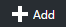

# The Things Network Azure IoT Hub Integration

This is an example integration between The Things Network and Azure IoT Hub. This integration will be offered as a bridge, which features creating devices in the Azure IoT Hub device registry as well as sending events from uplink messages.

### Prerequisites

1. A running TTN node connected to the TTN network
2. NodeJs (https://nodejs.org/en/). _(We prefer Version 6.6)_
3. Azure account [create here](https://azure.microsoft.com/en-us/free/) _(Azure passes will be present for those who have no Azure account)_
4. TTN account (https://account.thethingsnetwork.org/)
5. Device Explorer (https://github.com/Azure/azure-iot-sdks/blob/master/tools/DeviceExplorer/doc/how_to_use_device_explorer.md)


## Create an Azure IoT Hub

Follow these steps to create an Azure IoT Hub.

1. Log into the [Azure portal](https://portal.azure.com/). You will be asked to provide Azure credentials if needed
2. On the left, a number of common Azure services is shown. Select `More Services` to open a list with all available services

    

3. Filter it with `Iot Hub`

    

4. Select `Iot Hub` and a new blade will be shown. Select `Add` and you will be asked to enter the information needed to create an IoT Hub

    

5. Enter a unique IoT Hub name eg. `TechDays42ih`. A green sign will be shown if the name is unique
6. Enter a unique Resource Group eg. `TechDays42rg`. A green sign will be shown if the name is unique
7. Select `West Europe` for the location

    

8. Press `Create` and the portal will start creating the service. Once it is created, a notification is shown. In the right upper corner, a bell represents the list of all notifications shown

    

Creating an IoT Hub takes some time. Meanwhile we will create the bridge.


## Create a bridge

Follow these steps to create the integration bridge between The Things Network and Azure IoT Hub. NPM will be used to create a folder structure and imstall packages.

1. Create a new folder eg. `c:\techdays42`
2. In a dos-box, navigate to the new folder 
3. In this new folder, run `npm init` to initialize a new Bridge using Node.js. Some values will be presented to be changed; accept the initial values, only use `server.js` (instead of _index.js_ as entry point, if proposed)
   
   
   
4. Accept the changes to be written in a json file with yes (default option)
5. Run `npm install --save ttn-azure-iothub@preview` to install this package
6. Create a new file named `server.js` in the folder you created

This server.js file will be edited below but we need some secrets first. We have to collect unique keys of the TTN app and the Azure IoT Hub first.


### TTN Application

The integration requires an application and device configured in The Things Network.

1. Log into the [The Things Network dashboard](https://preview.dashboard.thethingsnetwork.org). You will be asked to provide TTN credentials if needed
2. Add a new application. Pick a unique Application ID

    

3. Go to **Manage devices** and click **Register device**
4. Enter a **Device ID** and click **Randomize** to use a random Device EUI
5. Click **Settings**
6. Check **Disable frame counter checks**
7. Click **Personalize device** and confirm by clicking **Personalize**

    

8. Go back to your application by clicking its name in the navigation bar
9. Scroll down to **Access Keys**. **Write down** the access key

    

These are the secrets needed for getting data from The Things Network.


### Azure IoT Hub secrets

The integration requires an Azure IoT Hub Shared access policy key name with `Registry, Write and Device connect` permissions. In this example, we use the **iothubowner** policy which has these permissions enabled by default.

1. Check the Azure portal. The Resource group and the IoT Hub should be created by now

    

2. On the left, select `Resource groups`. A list of resource groups is shown

    

3. Select the ResourceGroup `TechDays42rg`. It will open a new blade with all resources in this group
4. Select the IoT Hub `TechDays42ih`. It will open a new blade with the IoT Hub
5. The IoTHub has not received any messages yet. Check the general settings for `Shared access policies`

    

6. **Write down** the `name` of the IoT Hub eg. `TechDays42ih`
7. Navigate to the `iothubowner` policy and **write down** the primary key
8. In the last step op this tutorial, the 'Connection string-primary key' is needed. Remember this `Connection String-Primary Key`

    

These are the secrets needed from Azure.


### Edit server.js

Edit the file named server.js in the new folder.

```js
'use strict';

const ttnazureiot = require('ttn-azure-iothub');

// Replace with your AppEUI and App Access Key
const appEUI = '<insert AppEUI>';
const appAccessKey = '<insert App Access Key>';

// Replace with your Azure IoT Hub name and key
const hubName = '<insert hub name>';
const keyName = 'iothubowner';
const key = '<insert key>';

const bridge = new ttnazureiot.Bridge(appEUI, appAccessKey, hubName, keyName, key);

bridge.on('ttn-connect', () => {
  console.log('TTN connected');
});

bridge.on('error', err => {
  console.warn('Error', err);
});

bridge.on('uplink', data => {
  console.log('Uplink', data);
});
```


## Start the bridge

Run `npm start` to verify that the bridge works in the new folder. This is example output:

```
TTN connected
goat: Handling uplink
Uplink { devEUI: 'goat',
  message: '{"water":19,"deviceId":"goat","time":"2016-06-14T16:19:15.402956092Z"}' }
goat: Handling uplink
Uplink { devEUI: 'goat',
  message: '{"water":19,"deviceId":"goat","time":"2016-06-14T16:19:37.546601639Z"}' }
...
```

*Note: the message consists of valid Json telemetry.*

Keep the bridge running till the end of the workshop.  


## Monitoring the arrival of the telemetry in Azure

We can check the arrival of the messages in the Azure IoT Hub. This can be done using a UI app named Device Explorer or using a Command-Line tool named Hub Explorer.

### Monitoring using UI

We can check the arrival of the messages in the Azure IoT Hub.

1. Start the `Device Explorer`
2. On the Configuration Tab, insert the IoT Hub `Connection String-primary key` and the `name` of the IoT Hub (as Protocol Gateway Hostname)
3. Press `Update`
4. On the Management tab, your device should already be available. It was registered by the bridge when the very first telemetry arrived
5. On the Data tab, Select your `Device ID` and press `Monitor`

```
Receiving events...
09/23/16 21:43:47> Device: [goat], Data:[{"water":10}]
09/23/16 21:43:51> Device: [goat], Data:[{"water":15}]
09/23/16 21:43:53> Device: [goat], Data:[{"water":14}]
```

### Monitoring using Command-line

Via https://github.com/Azure/azure-iot-sdks/tree/master/tools/iothub-explorer

## Conclusion

The messages are shown here too. These messages are now available in Azure.

You are now ready to process your data in an Azure Stream Analytics job. Continue to [Handling The Things Network telemetry in Azure](Azure.md)


        
        
    
