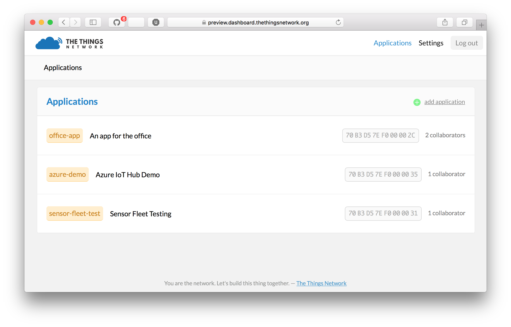

# The Things Network Azure IoT Hub Integration

This is an example integration between The Things Network and Azure IoT Hub. This integration will be offered as a bridge, which features creating devices in the Azure IoT Hub device registry as well as sending events from uplink messages.

*Note: in this workshop we will build a simple bridge, running on your own computer. See the [full example](https://github.com/TheThingsNetwork/examples/tree/master/integrations/azure) on how to deploy this bridge as a WebJob to Azure.*

### Prerequisites

1. A running TTN node connected to the TTN network
2. NodeJs [download here](https://nodejs.org/en/). _(Version 4.5 should be fine)_
3. Azure account [create here](https://azure.microsoft.com/en-us/free/) _(Azure passes will be present for those who have no Azure account)_
4. TTN account [create here](https://account.thethingsnetwork.org/register)
5. Device Explorer [download here](https://github.com/Azure/azure-iot-sdks/blob/master/tools/DeviceExplorer/doc/how_to_use_device_explorer.md)


## Create an Azure IoT Hub

Follow these steps to create an Azure IoT Hub.

1. Log into the [Azure portal](https://portal.azure.com/). You will be asked to provide Azure credentials if needed
2. On the left, a number of common Azure services is shown. Select `More Services` to open a list with all available services

    

3. Filter it with `Iot Hub`

    

4. Select `Iot Hub` and a new blade will be shown. Select `Add` and you will be asked to enter the information needed to create an IoT Hub

    

5. Enter a unique IoT Hub name eg. `TechDays42ih`. A green sign will be shown if the name is unique
6. Enter a unique Resource Group eg. `TechDays42rg`
7. Select `West Europe` for the location

    

8. Press `Create` and the portal will start creating the service. Once it is created, a notification is shown. In the right upper corner, a bell represents the list of all notifications shown

    

Creating an IoT Hub takes some time. Meanwhile we will create the bridge.


## Create a bridge

Follow these steps to create the integration bridge between The Things Network and Azure IoT Hub. NPM will be used to create a folder structure and imstall packages.

1. Install NodeJs
2. Create a new folder
3. In this new folder, run `npm init` to initialize a new WebJob using Node.js. Some values will be presented to be changed; accept the initial values, only use `server.js` as entry point
4. Run `npm install --save ttn-azure-iothub` to install this package
5. Create a new file named `server.js`

This server.js file will be edited below but we need some secrets first. We have to collect unique keys of the TTN app and the Azure IoT Hub first.


### TTN App secrets

The integration requires TTN portal AppEUI and App Access Key.

1. Log into the [TTN applications portal](https://staging.thethingsnetwork.org/applications). You will be asked to provide TTN credentials if needed
2. Your list of applications will be shown

    

3. Navigate to the application provided for this workshop
4. Under Application Info, click 'learn how to get data from this app' to get the application data

    

5. the `App EUI` and the `Access Keys` are shown. Remember these App EUI and access keys

    

These are the secrets needed from TTN.


### Azure IoT Hub secrets

The integration requires an Azure IoT Hub Shared access policy key name with `Registry, Write and Device connect` permissions. In this example, we use the **iothubowner** policy which has these permissions enabled by default.

1. Check the Azure portal. The Resource group and the IoT Hub should be created by now

    

2. On the left, select `Resource groups`. A List of resource groups is shown

    

3. Select the ResourceGroup `TechDays42rg`. It will open a new blade with all resources in this group
4. Select the IoT Hub `TechDays42ih`. It will open a new blade with the IoT Hub
5. The IoTHub has not received any messages yet. Check the general settings for `Shared access policies`

    

6. Remember the `name` of the IoT Hub eg. `TechDays42ih`
7. Navigate to the `iothubowner` policy and remember the primary key
8. In the last step op this tutorial, the 'Connection string-primary key' is needed. Remember this connection string

    

These are the secrets needed from Azure.


### Edit server.js

Edit the file named server.js in the new folder.

```js
'use strict';

const ttnazureiot = require('ttn-azure-iothub');

// Replace with your AppEUI and App Access Key
const appEUI = '<insert AppEUI>';
const appAccessKey = '<insert App Access Key>';

// Replace with your Azure IoT Hub name and key
const hubName = '<insert hub name>';
const keyName = 'iothubowner';
const key = '<insert key>';

const bridge = new ttnazureiot.Bridge(appEUI, appAccessKey, hubName, keyName, key);

bridge.on('ttn-connect', () => {
  console.log('TTN connected');
});

bridge.on('error', err => {
  console.warn('Error', err);
});

bridge.on('uplink', data => {
  console.log('Uplink', data);
});
```


## Start the bridge

Run `npm start` to verify that the bridge works in the new folder. This is example output:

```
TTN connected
0004A30B001B442B: Handling uplink
Uplink { devEUI: '0004A30B001B442B',
  message: '{"lux":1000,"water":19.82,"deviceId":"0004A30B001B442B","time":"2016-06-14T16:19:15.402956092Z"}' }
0004A30B001B442B: Handling uplink
Uplink { devEUI: '0004A30B001B442B',
  message: '{"lux":1010,"water":19.72,"deviceId":"0004A30B001B442B","time":"2016-06-14T16:19:37.546601639Z"}' }
...
```

*Note: the message consists of valid Json telemetry.*

Keep the bridge running till the end of the workshop.  


## Check the arrival of the telemetry in Azure

We can check the arrival of the messages in the Azure IoT Hub.

1. Install the Device Explorer. Start the Device Explorer
2. On the Configuration Tab, insert the IoT Hub `Connection String-primary key` and the `name` of the IoT Hub (as Protocol Gateway Hostname)
3. Press `Update`
4. On the Management tab, your device should already be available. It was registered by the bridge when the very first telemetry arrived
5. On the Data tab, Select your `Device ID` and press `Monitor`

```
Receiving events...
09/23/16 21:43:47> Device: [DeviceOne], Data:[{"water":10.0,"light":712}]
09/23/16 21:43:51> Device: [DeviceOne], Data:[{"water":15.0,"light":711}]
09/23/16 21:43:53> Device: [DeviceOne], Data:[{"water":14.0,"light":290}]
```

The messages are shown here too. These messages are now available in Azure.

You are now ready to process your data in an Azure Stream Analytics job.


