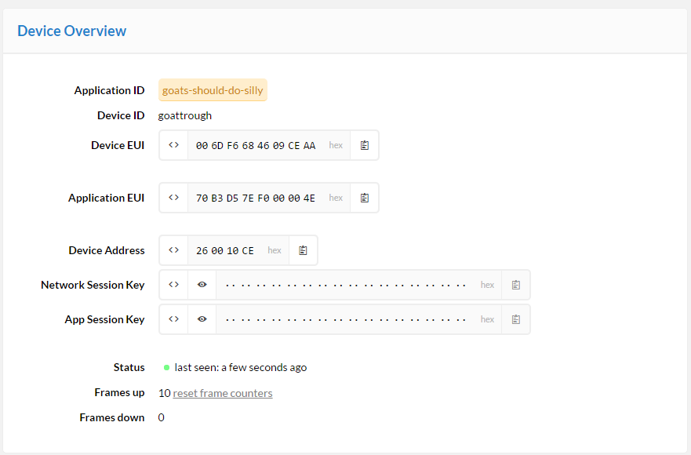
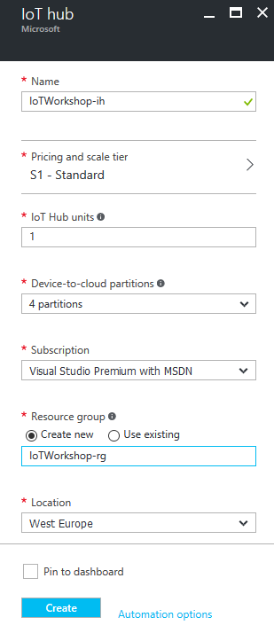
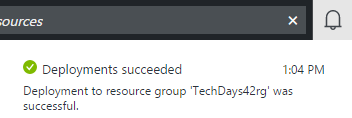

# The Things Network Azure IoT Hub Integration Bridge

This is an example integration between The Things Network and Azure IoT Hub. This integration will be offered as a bridge, which features creating devices in the Azure IoT Hub device registry as well as sending events from uplink messages.

*Note: in this workshop we will create uniquely named Azure resources. The suggested names could be reserved already.*

### Prerequisites

1. A running TTN node connected to the TTN network
2. NodeJs (https://nodejs.org/en/). _(We prefer Version 6.6)_
3. Azure account [create here](https://azure.microsoft.com/en-us/free/) _(Azure passes will be present for those who have no Azure account)_
4. TTN account (https://account.thethingsnetwork.org/)
5. [Device Explorer](https://github.com/Azure/azure-iot-sdks/blob/master/tools/DeviceExplorer/) _(for UI based usage)_ 
6. [IoT Hub Explorer](https://github.com/Azure/azure-iot-sdks/tree/master/tools/iothub-explorer) _(for Command-Line based usage)_ 

## Connect your device

Follow the workshop facilitator connect the sensors. A few important things:

- The passive infrared sensor (PIR) should be connected to the `5v` and digital pin `2`
- The water sensor should be connected to the `3v3` and analog pin `0` (`A0`)

Your device and sensors should be connected as follows:

   

   


## Read sensors

Open the Arduino IDE and follow these steps.

1. Connect The Things Uno to your computer
2. In the **Tools** menu, click **Board** and select **Arduino Leonardo**
3. In the **Tools** menu, click **Port** and select the serial port of your Arduino Leonardo
4. Paste the following code in a new sketch:
```c
// Define the pins of your sensors
#define PIN_PIR 2
#define PIN_WATER A0

// Setup runs once
void setup() {
  pinMode(PIN_PIR, INPUT);
}

// Loops runs indefinitely
void loop() {
  // Read the sensors
  uint8_t motion = digitalRead(PIN_PIR);
  uint16_t water = analogRead(PIN_WATER);

  // Only print the water value when there is motion
  if (motion == HIGH) {
    Serial.print("Water: ");
    Serial.println(water);
  }

  // Wait one second
  delay(1000);
}
```
5. In the **Sketch** menu, click **Upload**
6. Once the sketch has been uploaded, go to the **Tools** menu and open the **Serial Monitor**
7. You should see output like this, only new lines when there is motion (your PIR sensor lights up red):
```
Water: 572
Water: 573 
...
```

## Create The Things Network application

Follow the steps to create an application and register your device.

1. Log into the [The Things Network dashboard](https://preview.dashboard.thethingsnetwork.org). You will be asked to provide TTN credentials if needed
2. Add a new application. Pick a unique Application ID
    
3. Go to **Manage devices** and click **Register device**
4. Enter a **Device ID** and click **Randomize** to use a random Device EUI
5. Click **Settings**
6. Check **Disable frame counter checks**
7. Click **Personalize device** and confirm by clicking **Personalize**
    
8. Keep this page open, you need the device address, network session key and application session key in a minute


## Send data from your device

In the Arduino IDE, create a new sketch and paste the following code.

```c
#include <TheThingsNetwork.h>

// Set your DevAddr
const byte devAddr[4] = { ... }; //for example: {0x02, 0xDE, 0xAE, 0x00};

// Set your NwkSKey and AppSKey
const byte nwkSKey[16] = { ... }; //for example: {0x2B, 0x7E, 0x15, 0x16, 0x28, 0xAE, 0xD2, 0xA6, 0xAB, 0xF7, 0x15, 0x88, 0x09, 0xCF, 0x4F, 0x3C};
const byte appSKey[16] = { ... }; //for example: {0x2B, 0x7E, 0x15, 0x16, 0x28, 0xAE, 0xD2, 0xA6, 0xAB, 0xF7, 0x15, 0x88, 0x09, 0xCF, 0x4F, 0x3C};

TheThingsNetwork ttn;

// Define the pins of your sensors
#define PIN_PIR 2
#define PIN_WATER A0

// Setup runs once
void setup() {
  // The PIR is a digital input
  pinMode(PIN_PIR, INPUT);

  Serial.begin(9600);
  Serial1.begin(57600);

  ttn.init(Serial1, Serial);
  ttn.reset();

  //the device will configure the LoRa module
  ttn.personalize(devAddr, nwkSKey, appSKey);

  ttn.showStatus();
  Serial.println("Setup for The Things Network complete");
}

// Loop runs indefinitely
void loop() {
  // Read sensors
  uint8_t motion = digitalRead(PIN_PIR);
  uint16_t water = analogRead(PIN_WATER);

  // Check if there is motion
  if (motion == HIGH) {
    // Print the water value
    Serial.print("Water: ");
    Serial.println(water);

    // Send data to The Things Network
    byte buffer[2];
    buffer[0] = highByte(water);
    buffer[1] = lowByte(water);
    ttn.sendBytes(buffer, sizeof(buffer));
  }

  // Wait 10 seconds
  delay(10000);
}
```

1. Insert your device address in `devAddr`, nework session key in `nwkSkey` and application session key in `appSKey`. You can use the handy `<>` button in the dashboard to copy it quickly as a C-style byte array; exactly what Arduino wants.
2. In the **Sketch** menu, click **Upload**
3. Open the **Serial Monitor** again from the **Tools** menu once upload has completed. Your device should now be sending data to The Things Network
4. In The Things Network dashboard, go to **Data**. You see packets coming in:
    
5. Now, binary payload is not really useful in upstream. Therefore, we have payload functions.
6. In the application overview, click **Payload Functions**
7. Add the following **decoder** function to decode the two bytes back to a 16 bit integer called `water`:
```c
function Decoder(bytes) {
  var water = (bytes[0] << 8) | bytes[1];
  return {
    water: water
  };
}
```
8. We want to invert the resistance of the water sensor, so that more water is a higher value. The maximum value of 3v3 analog ADC conersion is `682`, so use the following as the **converter**:
```
function Converter(decodedObj) {
  decodedObj.water = 682 - decodedObj.water;
  return decodedObj;
}
```
9. Go back to your data overview. Now you should see something like this:
    

Now we have clean data ready to be processed in Azure IoT Hub and upstream.


## Create an Azure IoT Hub

Follow these steps to create an Azure IoT Hub.

1. Log into the [Azure portal](https://portal.azure.com/). You will be asked to provide Azure credentials if needed
2. On the left, a number of common Azure services are shown. Select `More Services` to open a list with all available services

    

3. Filter it with `IoT Hub`

    

4. Select `IoT Hub` and a new blade will be shown. Select `Add` and you will be asked to enter the information needed to create an IoT Hub

    

5. Enter a unique IoT Hub name eg. `TechDays42ih`. A green sign will be shown if the name is unique
6. Enter a unique Resource Group eg. `TechDays42rg`. A green sign will be shown if the name is unique
7. Select `West Europe` for the location

    

8. Press `Create` and the portal will start creating the service. Once it is created, a notification is shown. In the right upper corner, a bell represents the list of all notifications shown

    

Creating an IoT Hub takes some time. Meanwhile we will connect the device and create the bridge.

## Create a bridge

Follow these steps to create the integration bridge between The Things Network and Azure IoT Hub. NPM will be used to create a folder structure and install packages.

1. Create a new folder eg. `c:\techdays42`
2. In Command Prompt, navigate to the new folder 
3. In this new folder, run `npm init` to initialize a new Node.js application. Some values will be presented to be changed; accept the initial values, only use `server.js` (instead of _index.js_ as entry point, if proposed)
   
   
   
4. Accept the changes to be written in a json file with yes (default option)
5. Run `npm install --save ttn-azure-iothub@preview` to install this package
6. Create a new file named `server.js` in the folder you created

This server.js file will be edited below but we need some secrets first. We have to collect unique keys of the TTN app and the Azure IoT Hub first.

### TTN Application

The integration requires an application and device configured in The Things Network.

1. Go to your application by clicking its name in the navigation bar
2. Scroll down to **Access Keys**. **Write down** the access key
    

The `Application ID` and `Access Key` are required to get data from The Things Network.

### Collect Azure IoT Hub secrets

The integration requires an Azure IoT Hub Shared access policy key name with `Registry read, write and Device connect` permissions. In this example, we use the **iothubowner** policy which has these permissions enabled by default.

1. Check the Azure portal. The resource group and the IoT Hub should be created by now

    

2. On the left, select `Resource groups`. A list of resource groups is shown

    

3. Select the resource group `TechDays42rg`. It will open a new blade with all resources in this group
4. Select the IoT Hub `TechDays42ih`. It will open a new blade with the IoT Hub

    

5. The IoTHub has not received any messages yet. Check the general settings for `Shared access policies`

    

6. **Write down** the `name` of the IoT Hub eg. `TechDays42ih`
7. Navigate to the `iothubowner` policy and **write down** the primary key

    

8. In the last step op this Bridge tutorial, the 'Connection string-primary key' is needed. **write down** this `Connection String-Primary Key` too

These are the secrets needed from the Azure IoT Hub.

### Edit server.js

Edit the file named server.js in the new folder. `Fill in` the secrets and `save` the file.

```js
'use strict';

const ttnazureiot = require('ttn-azure-iothub');

// Replace with your AppEUI and App Access Key
const appEUI = '<insert AppEUI>';
const appAccessKey = '<insert App Access Key>';

// Replace with your Azure IoT Hub name and key
const hubName = '<insert hub name>';
const keyName = 'iothubowner';
const key = '<insert key>';

const bridge = new ttnazureiot.Bridge(appEUI, appAccessKey, hubName, keyName, key);

bridge.on('ttn-connect', () => {
  console.log('TTN connected');
});

bridge.on('error', err => {
  console.warn('Error', err);
});

bridge.on('uplink', data => {
  console.log('Uplink', data);
});
```

This is the most basic example of a bridge between TTN and Azure. 

## Start the bridge

Run `npm start` to verify that the bridge works in the new folder. This is example output:

```
TTN connected
goat: Handling uplink
Uplink { devEUI: 'goat',
  message: '{"water":19,"deviceId":"goat","time":"2016-06-14T16:19:15.402956092Z"}' }
goat: Handling uplink
Uplink { devEUI: 'goat',
  message: '{"water":19,"deviceId":"goat","time":"2016-06-14T16:19:37.546601639Z"}' }
...
```

*Note: the message consists of valid Json telemetry.*

*Note: Keep the bridge running untill the end of the complete workshop.*  


## Monitoring the arrival of the telemetry in Azure

We can check the arrival of messages in the Azure IoT Hub. This can be done using a UI app named Device Explorer or using a Command-Line tool named IoT Hub Explorer. `Choose one` 

### Monitoring using UI

We can check the arrival of the messages in the Azure IoT Hub using the Device Explorer. This tool is UI based, please check the installation requirements.

1. Start the `Device Explorer`
2. On the Configuration Tab, insert the IoT Hub `Connection String-primary key` and the `name` of the IoT Hub (as Protocol Gateway Hostname)
3. Press `Update`
4. On the Management tab, your device should already be available. It was registered by the bridge the very first time, telemetry arrived
5. On the Data tab, Select your `Device ID` and press `Monitor`
6. This will result in the following messages

```
Receiving events...
09/23/16 21:43:47> Device: [goat], Data:[{"water":10}]
09/23/16 21:43:51> Device: [goat], Data:[{"water":15}]
09/23/16 21:43:53> Device: [goat], Data:[{"water":14}]
```

### Monitoring using Command-line

We can check the arrival of the messages in the Azure IoT Hub using the IoT Hub Explorer. This tool is Command-Line based, please check the installation requirements. 

*Note : See the [full example](https://github.com/Azure/azure-iot-sdks/tree/master/tools/iothub-explorer) for more options of this tool.*

1. Create a new folder eg. `c:\iothubexplorer`
2. In a dos-box, navigate to the new folder 
1. In this folder, to install the latest (pre-release) version of the iothub-explorer tool, run the following command `npm install -g iothub-explorer@latest` in your command-line environment
2. Login to the IoT Hub Explorer by supplying your IoT Hub `Connection String-primary key` using the command `iothub-explorer login "your connection string"`
3. A session with the IoT Hub will start and it will last for approx. one jour:

    ```
    Session started, expires Tue Sep 27 2016 18:35:37 GMT+0200 (W. Europe Daylight Time)
    ```

4. To monitor the device-to-cloud messages from a device, use the following command `iothub-explorer "[your connection string]" monitor-events [device name]`  and `fill in` your  *remembered* 'Connection String-primary key' and *remember* device name
5. This will result in the following messages

    ```
    Monitoring events from device goat
    Event received:
    {
      "water": 12
    }
    ```

## Conclusion

The messages are shown here too. These messages are now available in Azure.

Next Step: You are now ready to process your data in an Azure Function. Continue to [Handling The Things Network telemetry in Azure](Azure.md)


        
        
    
