# The Things Network & Azure IoT: a perfect combination
## The Things Network Azure IoT Hub Integration Bridge

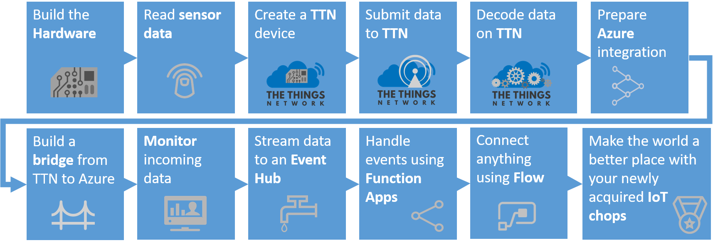

This is an example integration between The Things Network and Azure IoT Hub. This integration will be offered as a bridge, which features creating devices in the Azure IoT Hub device registry as well as sending events from uplink messages.

*Note: In this workshop, we will create uniquely named Azure resources. The suggested names could be reserved already. Just try another unique name.*

### Prerequisites

1. A computer with internet access
2. A The Things Uno, a Grove - Water Sensor, a Grove - PIR Motion Sensor, wiring & a micro USB cable
3. Arduino IDE [http://arduino.cc](http://arduino.cc)
4. Node.js [https://nodejs.org/en/](https://nodejs.org/en/). _(We prefer Version 6)_
5. Azure account [create here](https://azure.microsoft.com/en-us/free/) _([Azure passes](https://www.microsoftazurepass.com/howto) will be present for those who have no Azure account)_
6. TTN account [https://account.thethingsnetwork.org/](https://account.thethingsnetwork.org/)
7. Bridge software between TTN and Azure [TtnAzureBridge](https://github.com/sandervandevelde/TtnAzureBridge) (or [as zip](https://1drv.ms/f/s!At-2dMPHYH4-kP0ENT3ieMCvJPxeKA))
8. [IoT Hub Explorer](https://www.npmjs.com/package/iothub-explorer) _(for Command-Line interface based usage; see below for installation steps)_ or [Device Explorer](https://github.com/fsautomata/azure-iot-sdks/blob/master/tools/DeviceExplorer/doc/how_to_use_device_explorer.md) _(for GUI based usage; see below for installation steps)_  

## Connect your device

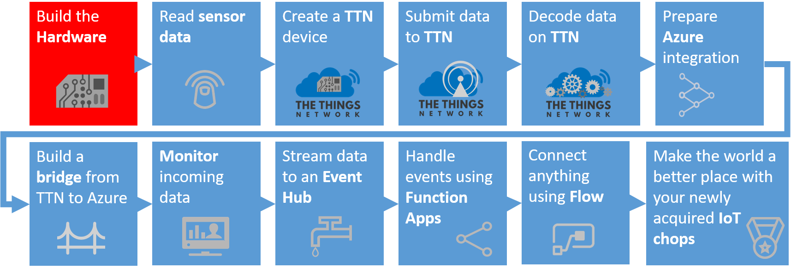

Follow the workshop facilitator connecting the sensors. A few important things:

- The Button VCC pin (red cable) is connected to the `5v` pin on the The Things Uno
- The Button SIG/OUT (brown cable) pin is connected to the digital pin `4` (fifth pin in the pin header) on the The Things Uno
- The Button GND pin (white cable) is connected to one of the `GND` pins on the The Things Uno
- The LED SIG/IN pin (blue cable) is connected to the digital pin `10` on the The Things Network Uno
- The LED GND pin (brown cable) is connected to one of the `GND` pins on the The Things Uno

Your device and sensors should be connected as follows:

* Overview

   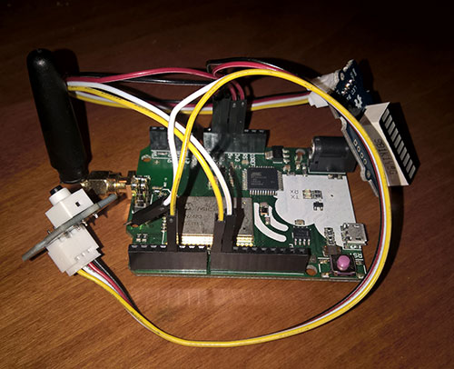

* Details pin layout node

   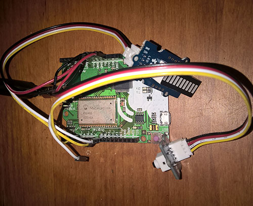

* Button pin layout 

   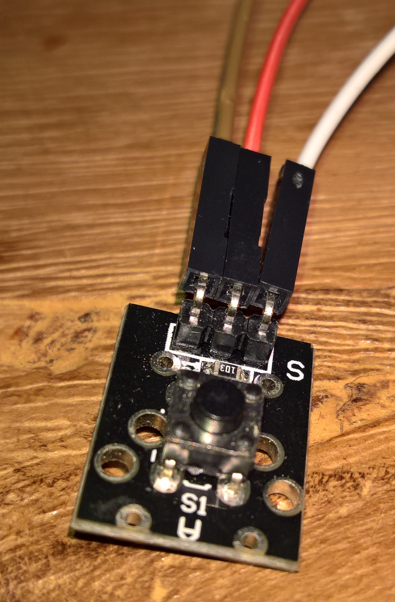

* LED pin layout 

   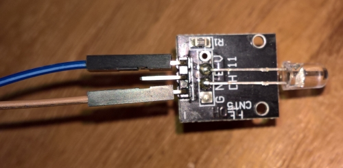


## Read sensors

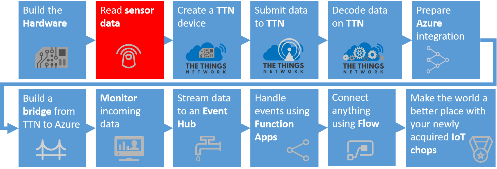

We start with running a simple sketch on the Arduino. This is a program which simulates a machine and when you press a button it 'breaks down'.

1. Open the Arduino IDE
2. Connect The Things Uno via the micro USB cable to your computer
3. In the **Tools** menu, click **Board** and select **Arduino Leonardo**
4. In the **Tools** menu, click **Port** and select the serial port of your **COMx (Arduino Leonardo)**
5. Paste the following code in a new sketch:

    ```c
    int commButton = 4;
    int commLed = 10;
    int cycleCompleted = 0;
    int errorCode = 0;

    void setup() {
      Serial.begin(9600);
  
      pinMode(commLed, OUTPUT);
      pinMode(commButton, INPUT);
  
      digitalWrite(commLed, HIGH);
     }

    void loop() {
 
      // If not in error state, update the number of cycles
      if (errorCode == 0) {
        cycleCompleted++;  
         Serial.print("Cycle completed: ");
         Serial.println(cycleCompleted );
      }

      // In the button is pushed, the machine enters an error state
      if (digitalRead(commButton) == LOW) {
        errorCode = 99;
        digitalWrite(commLed, LOW);
        Serial.print("Error occured: ");
        Serial.println( errorCode);
        Serial.println("Repair of machine needed...");
      }

      delay(1000);
    } 
    ```

7. In the **Sketch** menu, click **Verify/Compile**
8. In the **Sketch** menu, click **Upload**
9. Once the sketch has been uploaded, go to the **Tools** menu and open the **Serial Monitor**
10. You should see output like this, just wait a few seconds before pushing the button:

    ```
    ...
    Cycle completed: 4
    Cycle completed: 5
    Cycle completed: 6
    Error occured: 99
    Repair of machine needed...
    ```

Now we have a running Arduino with some basic logic. Let's send some messages using the The Things Network.

## Create The Things Network application

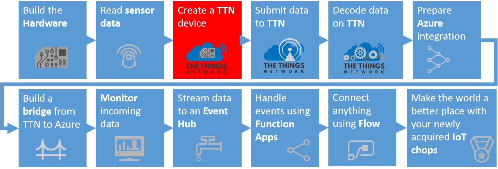

Follow the steps to create an application and register your device.

1. Log into the [The Things Network dashboard](https://console.thethingsnetwork.org). You will be asked to provide TTN credentials if needed
2. A TTN application is a logical container of several devices, providing the same telemetry. There are no TTN applications yet

    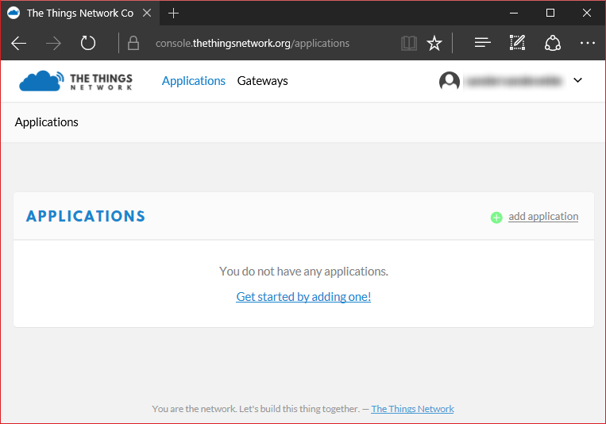

3. Add a new application. Pick a unique Application ID (for example `predictive_maintenance` in lower case) and fill in a description

    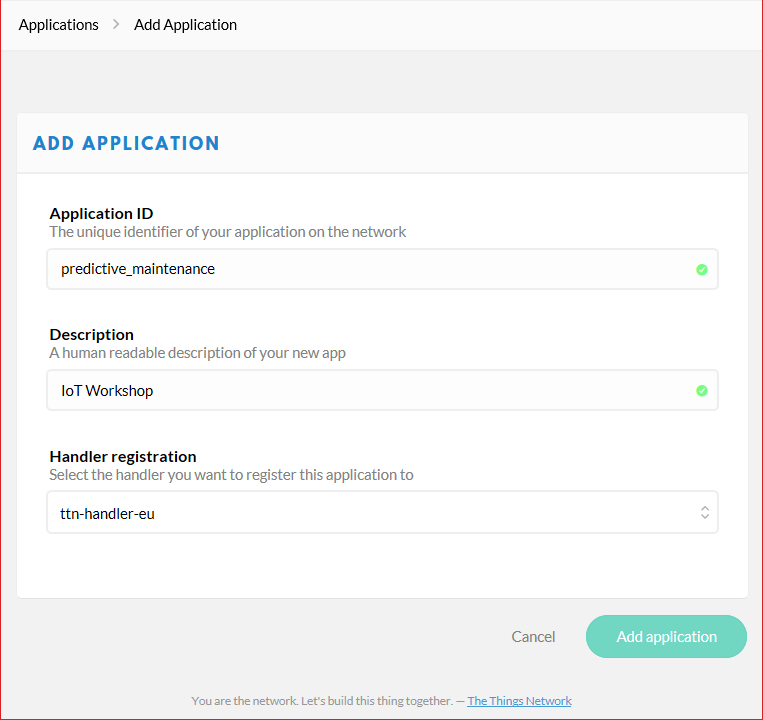

4. Go to **Devices**

    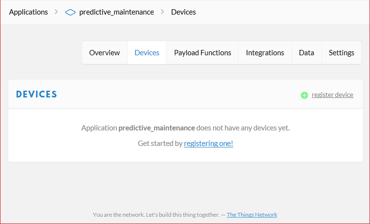

5. Click **Register device**
6. Enter a **Device ID** (for example `predictive_maintenance_machine_42` in lower case) 

    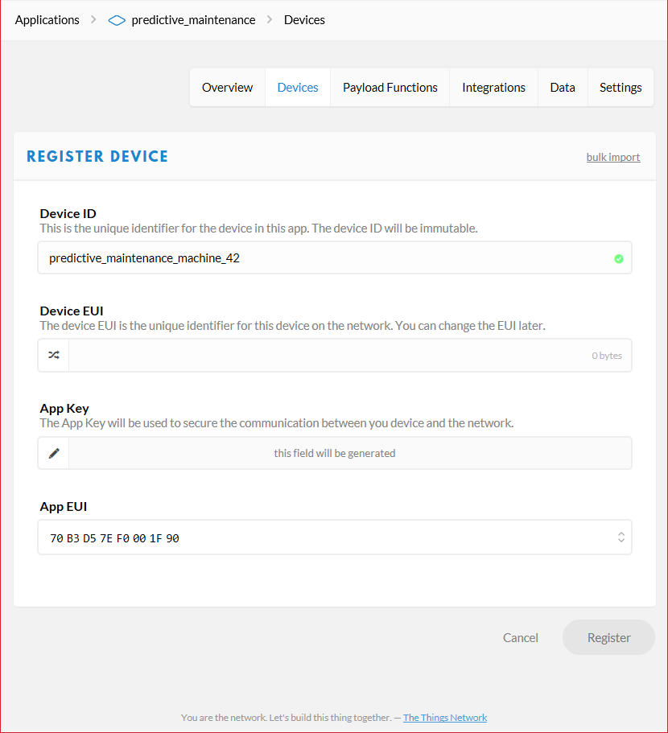

7. Notice that the Register button is still disabled. A device needs a unique unique identifier
8.  Click the **Generate** icon for 'Device EUI' so a unique EUI can be generated on register

    

9. The text in the EUI textbox is changed
10. The register button is now enabled. Click **Register** 
11. The device is now created

    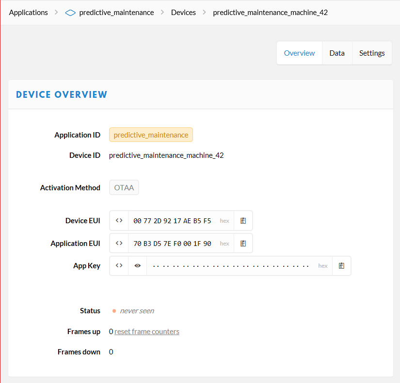

12. Now we have to fine tune the settings
13. Click **Settings** in the upper right corner
14. Select activation method **ABP** instead of OTAA
15. And uncheck **Frame counter checks** *Note: As stated, Disabling frame counter checks drastically reduces security and should only be used for development purposes. In this workshop, this makes you more flexible*

    

16. Click **Save**
17.  The following device settings are shown

    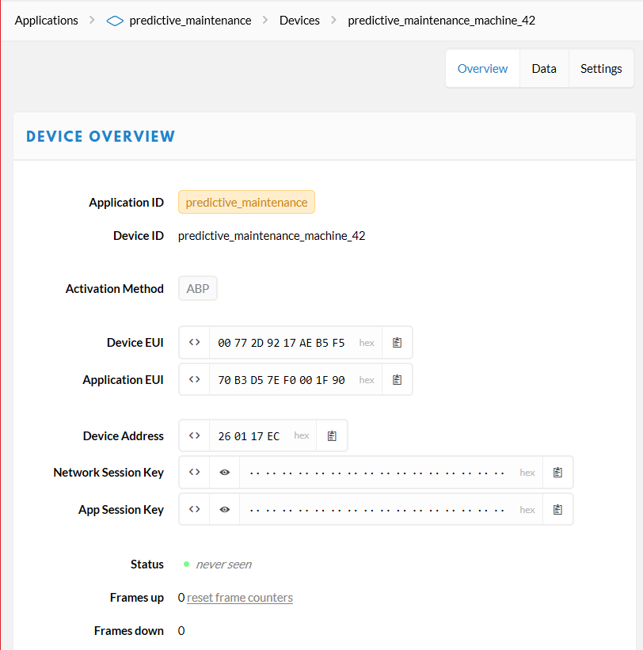

18. Keep this page open, you need the device address, network session key and application session key in a minute

The TTN application is now created.

## Send data from your device

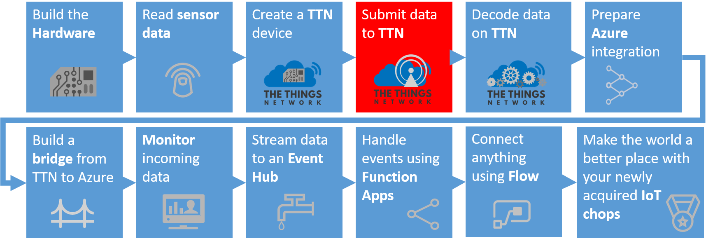

The sensor data is read, now it is time to send the sensor data to The Things Network. 

1. In the Arduino IDE, from the **File** menu, choose **New** to create a new sketch and paste the following code:

    ```c
    #include <TheThingsNetwork.h>

    const char *devAddr = "00000000";
    const char *nwkSKey = "00000000000000000000000000000000";
    const char *appSKey = "00000000000000000000000000000000";

    #define loraSerial Serial1
    #define debugSerial Serial

    #define freqPlan TTN_FP_EU868

    TheThingsNetwork ttn(loraSerial, debugSerial, freqPlan);

    int commButton = 4;
    int commLed = 10;
    int cycleCompleted = 0;
    int errorCode = 0;

    #define debugSerial Serial
    #define loraSerial Serial1

    void setup() {
      loraSerial.begin(57600);
      debugSerial.begin(9600);

      pinMode(commLed, OUTPUT);
      pinMode(commButton, INPUT);
  
      delay(1000);
  
      debugSerial.print("Initializing");

      //Initializing TTN communcation...

      ttn.personalize(devAddr, nwkSKey, appSKey);
  
      digitalWrite(commLed, HIGH);
  
      debugSerial.print("The Things Network connected");
    }

    void loop() {

      // If not in error state, update the number of cycles
      if (errorCode == 0) {
        cycleCompleted++;  
      }
 
      // In the button is pushed, the machine enters an error state
      if (digitalRead(commButton) == LOW) {  
        errorCode = 99;
        digitalWrite(commLed, LOW);
        debugSerial.print("Error occured");
      }

      // Communicate with TTN about number of cycles and current state (error code)
      byte buffer[2];
      buffer[0] = (byte) cycleCompleted;
      buffer[1] = (byte) errorCode;

      // send message to TTN
      ttn.sendBytes(buffer, sizeof(buffer));

      delay(5000);
    } 
    ```

2. Insert your device address in `devAddr`, network session key in `nwkSkey` and application session key in `appSKey`. You can use the handy `<>` button in the dashboard to copy it quickly as a C-style byte array; exactly what Arduino wants

    

3. In the **Sketch** menu, click **Upload**
4. Open the **Serial Monitor** again from the **Tools** menu once upload has completed. Your device should now be sending data to The Things Network

    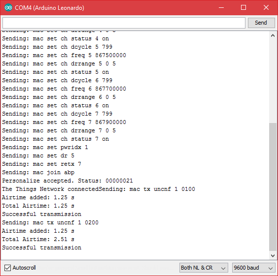

5. In The Things Network dashboard, go to **Data**. You see packets coming in:

    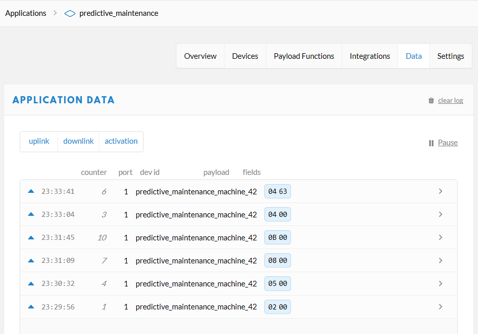

We are now receiving row data. We can decode and transform this in the TTN portal towards JSON messages.

## Decode data on TTN

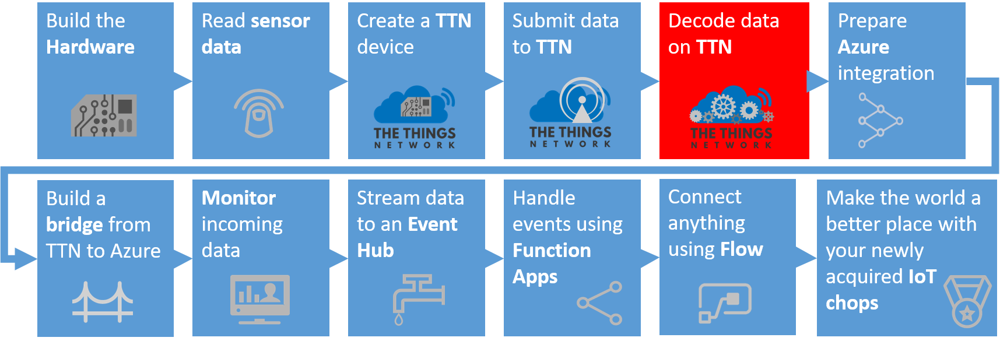

Now, the binary payload is not really useful in upstream. We want JSON. Therefore, we have payload functions.

1. In the application overview, click **Payload Functions**
2. Add the following **decoder** function to decode the two bytes back to the number of cycles completed and the current state:

    ```c
    function Decoder(bytes, port) {
      var cyclesCompleted = bytes[0];
      var errorCode = bytes[1];
  
      return {
        cyclesCompleted: cyclesCompleted,
        errorCode: errorCode
      };
    }
    ```

3. Test before you can save the decode function. Enter eg '2A00' in the payload and click **Test**. A decoded JSON message should become visible

    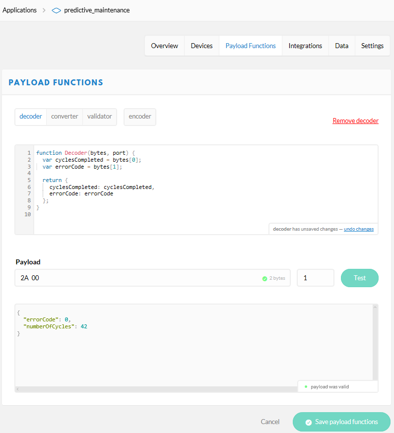

4. We want to rearrange the order of the JSON element. So use the following function as the **converter**:

    ```c
    function Converter(decoded, port) {
      return { 
        errorCode: decoded.errorCode,
        numberOfCycles: decoded.cyclesCompleted 
      };
    }
    ```

5. Test before you can save the converter function. Again, enter eg '2A00' in the payload and click **Test**. The converted JSON message should become visible
6. Finally, scroll to the bottom of the page and click **Save**
7. Go back to your data overview. Now you should see something like this:

    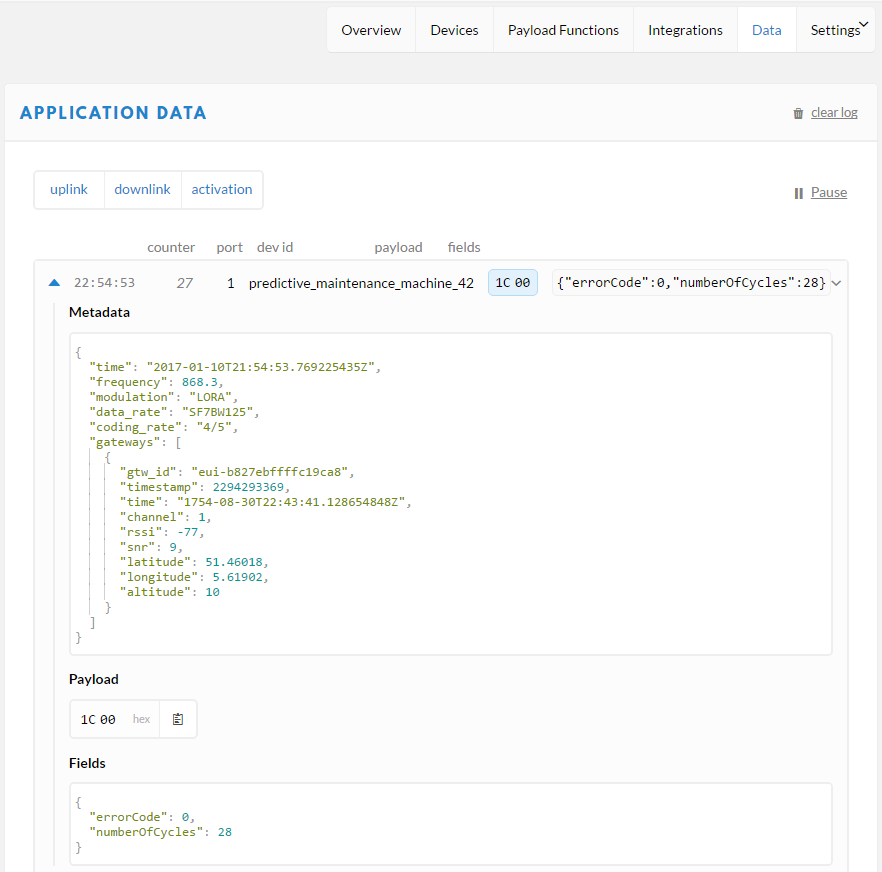

Now we have clean JSON data ready to be processed in Azure IoT Hub and upstream.

### Collect TTN Application secrets

We now have our telemetry in the TTN back-end. Our goal is to pass the telemetry through the Azure IoT Platform. Now, we will create a bridge between the two platforms. But again we need some secrets so only we can access our telemetry.
We have to collect unique keys of the TTN app.

1. Go to your TTN application **Overview** in the navigation bar
2. **Write down** the 'Application ID'
3. Scroll down to **Access Keys**. **Write down** the 'Access Key'

    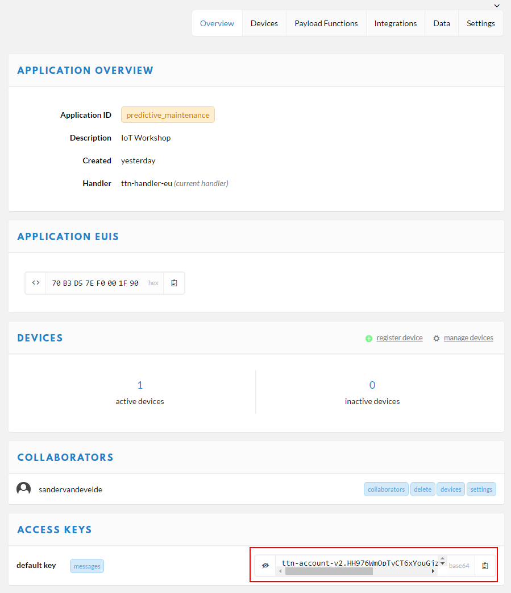

The `Application ID` and `Access Key` are required to get data from The Things Network.

## Create an Azure IoT Hub

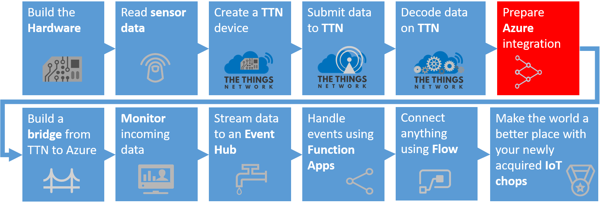

Follow these steps to create an Azure IoT Hub.

1. Log into the [Azure portal](https://portal.azure.com/). You will be asked to provide Azure credentials if needed
2. On the left, a number of common Azure services are shown. Select `More Services` to open a list with all available services

    

3. Filter it with `IoT Hub`

    

4. Select `IoT Hub` and a new blade will be shown. Select `Add` and you will be asked to enter the information needed to create an IoT Hub

    

5. Enter a unique IoT Hub name eg. `IoTWorkshop-ih`. A green sign will be shown if the name is unique
6. Enter a unique Resource Group eg. `IoTWorkshop-rg`. A green sign will be shown if the name is unique
7. Select `West Europe` for the location, if needed

    

8. Press `Create` and the portal will start creating the service. Once it is created, a notification is shown. In the right upper corner, a bell represents the list of all notifications shown

    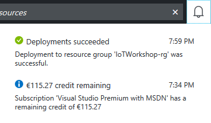

Creating an IoT Hub takes some time. Meanwhile, we will connect the device and create the bridge.

### Collect Azure IoT Hub secrets

The integration requires an Azure IoT Hub Shared access policy key name with `Registry read, write and Device connect` permissions. In this example, we use the **iothubowner** policy which has these permissions enabled by default.

1. Check the Azure portal. The resource group and the IoT Hub should be created by now (otherwise we were unable to send duty cycles information to it)

    

2. On the left, select `Resource groups`. A list of resource groups is shown

    

3. Select the resource group `IoTWorkshop-rg`. It will open a new blade with all resources in this group
4. Select the IoT Hub `IoTWorkshop-ih`. It will open a new blade with the IoT Hub

    

5. The IoTHub has not received any messages yet. Check the general settings for `Shared access policies`

    

6. **Write down** the `name` of the IoT Hub eg. `IoTWorkshop-ih`
7. Navigate to the 'iothubowner' policy and **write down** this `Connection String-Primary Key`

    

This is the secret needed from the Azure IoT Hub.

## Create a bridge


Follow these steps to create the integration bridge between The Things Network and Azure IoT Hub. 

1. **Create** a new folder eg. `c:\IoTWorkshop`
2. **Copy** the zip file 'TTNAzureBridge.zip' from [this OneDrive location](https://1drv.ms/f/s!At-2dMPHYH4-kP0ENT3ieMCvJPxeKA) to this folder and **unzip** it

    

3. **Navigate** to the folder with the executable and identify the config file name 'TtnAzureBridge.exe.config'
2. **Open** this config file in notepad or another text file editor
3. **Replace** [TTN App EUI] with the `TTN Application ID`
6. **Replace** [TTN App Access Key] with the `TTN Access Key`
7. **Replace** twice [iothub name] with the `name` of the IoT Hub, both in the app settings as in the connection string 'IoTHub'
8. In the connectionstring of 'IoTHub', **replace** [shared access key] with the remembered `Connection String-Primary Key` 
   
   
   
4. **Save** the config file and close the editor

The bridge is now ready for execution.

### Start the bridge

You are about to retrieve the telemetry from TTN.

2. In a dos-box (press Windows button-R, type CMD and enter), navigate to the new folder `c:\iotworkshop`
2. In the same folder, **run** `TtnAzureBridge.exe` to verify the bridge is working
   
   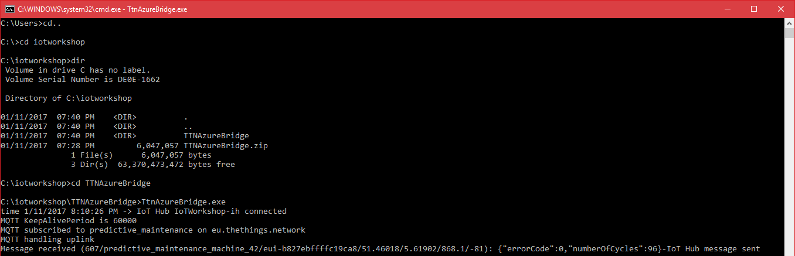

3. This is example output:

    ```
    time 1/11/2017 8:16:29 PM -> IoT Hub IoTWorkshop-ih connected
    MQTT KeepAlivePeriod is 60000
    MQTT subscribed to predictive_maintenance on eu.thethings.network
    MQTT handling uplink
    Message received (2/predictive_maintenance_machine_42/eui-b827ebffffc19ca8/51.46018/5.61902/868.1/-76): {"errorCode":0,"numberOfCycles":3}-IoT Hub message sent
    MQTT handling uplink
    Message received (12/predictive_maintenance_machine_42/eui-b827ebffffc19ca8/51.46018/5.61902/868.1/-77): {"errorCode":0,"numberOfCycles":13}-IoT Hub message sent
    ...
    ```

4. The telemetry is passed to the connect Azure IoTHub. We also see some basic information about the framecount, the node, the name and location of the gateway, the Lora channel used and the quality of the reception (RSSI)

*Note: the message consists of valid JSON telemetry.*

*Note: Keep the bridge running until the end of the complete workshop.*

## Select your favorite tool for monitoring


We can check the arrival of messages in the Azure IoT Hub. This can be done using a UI app named Device Explorer or using a Command-Line tool named IoT Hub Explorer. `Choose one below` 

### Monitoring using UI

We can check the arrival of the messages in the Azure IoT Hub using the Device Explorer.

The Device Explorer tool is a Windows-only graphical tool for managing your devices in IoT Hub.

The easiest way to install the Device Explorer tool in your environment is to download the pre-built version by clicking [Azure IoT SDKs releases](https://github.com/Azure/azure-iot-sdks/releases). Scroll down to the Downloads section to locate the download link for the SetupDeviceExplorer.msi installer. Download and run the installer.

To run the Device Explorer tool, double-click the DeviceExplorer.exe file in Windows Explorer. The default installation folder for this application is C:\Program Files (x86)\Microsoft\DeviceExplorer.

1. Start the `Device Explorer` from the desktop or using the start menu
2. On the Configuration Tab, insert the IoT Hub `Connection String-primary key` and the `name` of the IoT Hub (as Protocol Gateway Hostname)
3. Press `Update`
4. On the Management tab, your device should already be available. It was registered by the bridge the very first time, telemetry arrived

    

5. On the Data tab, Select your `Device ID` (like 'MachineCyclesUwp') and press `Monitor`
6. in the UWP app, press `Send cycle updates` a couple of times
7. This will result in the following messages when you send some Duty Cycle telemetry in your UWP app

    ```
    Receiving events...
    1/5/2017 9:46:18 PM> Device: [MachineCyclesUwp], Data:[{"errorCode":0,"numberOfCycles":1}]
    1/5/2017 9:46:19 PM> Device: [MachineCyclesUwp], Data:[{"errorCode":0,"numberOfCycles":2}]
    1/5/2017 9:46:20 PM> Device: [MachineCyclesUwp], Data:[{"errorCode":0,"numberOfCycles":3}]
    ```

### Monitoring using Command-line

We can check the arrival of the messages in the Azure IoT Hub using the IoT Hub Explorer. This tool is Command-Line based, please check the installation requirements. 

*Note : See the [full example](https://www.npmjs.com/package/iothub-explorer) for more options of this tool.*

1. Create a new folder eg. `c:\iothubexplorer`
2. In a dos-box (press Windows button-R, type CMD and enter), navigate to the new folder `c:\iothubexplorer`
3. In this folder, run the following command `npm install -g iothub-explorer@latest` in your command-line environment, to install the latest (pre-release) version of the iothub-explorer tool
4. Login to the IoT Hub Explorer by supplying your *remembered* IoT Hub `Connection String-primary key` using the command `iothub-explorer login "[your connection string]"`
5. A session with the IoT Hub will start and it will last for approx. one hour:

    ```
    Session started, expires on Thu Jan 05 2017 22:53:55 GMT+0100 (W. Europe Standard Time)
    ```

6. To monitor the device-to-cloud messages from a device, use the following command `iothub-explorer monitor-events --login [your connection string]` and `fill in` your *remembered* IoT Hub 'Connection String-primary key'
7. All devices are monitored now. This will result in the following messages

    ```
    Monitoring events from all devices...
    From: MachineCyclesUwp
    {
      "errorCode": 0,
      "numberOfCycles": 8
    }
    -------------------
    From: MachineCyclesUwp
    {
      "errorCode": 0,
      "numberOfCycles": 9
    }
    -------------------
    ```


## Conclusion

The messages are shown here too. These messages are now available in Azure.

Next Step: You are now ready to process your data in an Azure Function. Continue to [Receivig and handling The Things Network telemetry in Azure](Azure.md)

