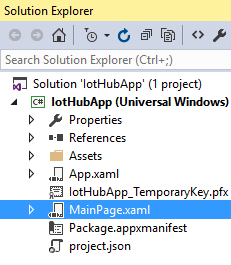
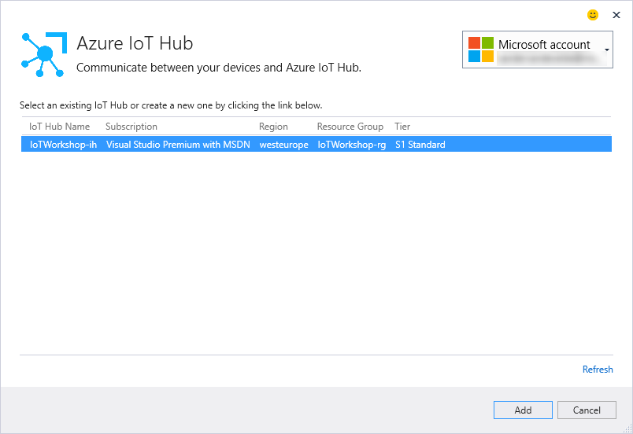
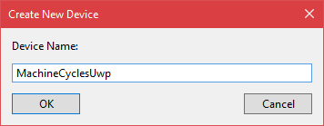
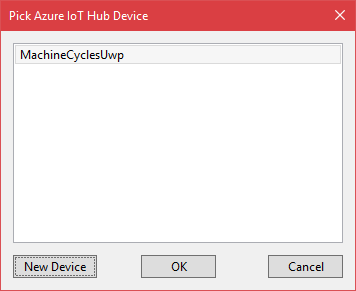
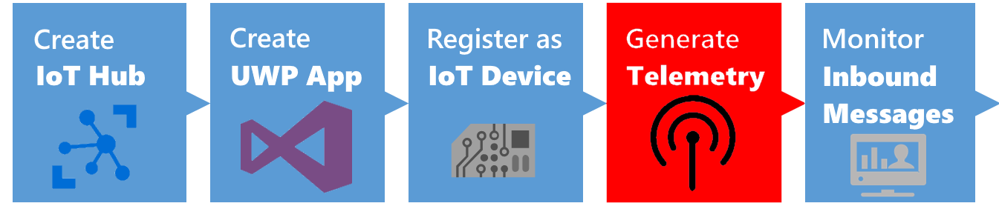
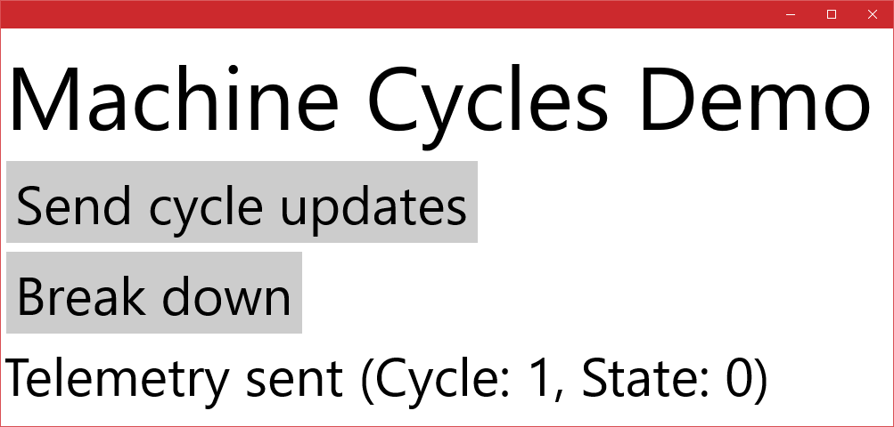

## Connecting to an IoT Hub using a UWP app


This is an example integration between a UWP app and Azure IoT Hub. This integration shows features like creating devices in the Azure IoT Hub device registry as well as sending telemetry to the IoT Hub.

*Note: In this workshop, we will create uniquely named Azure resources. The suggested names could be reserved already.*

*Note: The IoT Hub also offers the ability of sending commands back to devices. This is not part of this workshop.*

### Prerequisites

1. A Windows 10 computer with internet access
2. Visual Studio 2015 Community edition of higher [https://www.visualstudio.com/vs/community/](https://www.visualstudio.com/vs/community/)
3. Universal Windows App Development Tools (Windows SDK) [https://developer.microsoft.com/en-US/windows/downloads/windows-10-sdk](https://developer.microsoft.com/en-US/windows/downloads/windows-10-sdk)
4. Visual Studio Extension 'Connected Service for Azure IoT Hub' [https://visualstudiogallery.msdn.microsoft.com/e254a3a5-d72e-488e-9bd3-8fee8e0cd1d6](https://visualstudiogallery.msdn.microsoft.com/e254a3a5-d72e-488e-9bd3-8fee8e0cd1d6)
5. Node.js [https://nodejs.org/en/](https://nodejs.org/en/). _(We prefer Version 6.6)_
6. Azure account [create here](https://azure.microsoft.com/en-us/free/) _([Azure passes](https://www.microsoftazurepass.com/howto) will be present for those who have no Azure account)_
7a. [IoT Hub Explorer](https://github.com/Azure/azure-iot-sdks/tree/master/tools/iothub-explorer) _(for Command-Line interface  based usage)_ 
7b. or [Device Explorer](https://github.com/Azure/azure-iot-sdks/blob/master/tools/DeviceExplorer/) _(for GUI based usage)_  

### Objectives

In this work shop, you will learn:

1. Creating an IoT Hub in the Azure Portal
2. Creating a new UWP App
3. Connect to the IoT Hub and register the app like a device
4. Generate and send dummy telemetry
5. Check the arrival of the telemetry

## Creating an Azure IoT Hub in the Azure portal


Follow these steps to create an Azure IoT Hub.

1. Log into the [Azure portal](https://portal.azure.com/). You will be asked to provide Azure credentials if needed
2. On the left, a number of common Azure services are shown. Select `More Services` to open a list with all available services

    

3. Filter it with `IoT Hub`

    

4. Select `IoT Hub` and a new blade will be shown. Select `Add` and you will be asked to enter the information needed to create an IoT Hub

    

5. Enter a unique IoT Hub name eg. `IoTWorkshopih`. A green sign will be shown if the name is unique
6. Enter a unique Resource Group eg. `IoTWorkshoprg`. A green sign will be shown if the name is unique
7. Select `West Europe` for the location

    

8. Press `Create` and the portal will start creating the service. Once it is created, a notification is shown. In the right upper corner, a bell represents the list of all notifications shown

    

Creating an IoT Hub takes some time. Meanwhile, we will start with the app which will connect to the IoT Hub later on.


## creating a new UWP App


We will create a UWP app in Visual Studio. These apps are called Universal Windows Apps because they are supported by all sorts of devices running Windows 10. This includes laptops, PC's, Mobile devices like phones and tablets, the Xbox One, The Surface Hub, The Hololens and even the Raspberry Pi.

1. Start Visual Studio
2. On the Start Page or using the Menu, select New Project...

    

3. In the dialog, select the `Blank App (Universal Windows)` template

    

4. Select `Ok`. Iy you are asked which minimal platform version must be loaded, just press `Ok` again

    

*Note: If you do not have the Windows 10 Aniversary edition installed, please select the previous SDK*
 
5. Recompile the app and check if the build completes without errors. Press `F6` or use the menu `BUILD|Build Solution`

    

6. Start the app by pressing `F5` or use the menu `DEBUG|Start Debugging`
7. The app starts and an empty form is shown

The app is created. You are now ready to add a connection to the IoT Hub.


## Connect to the IoT Hub and register the app like a device


Let's add a connection to IoT hub and register the app like a real device.

1. Stop the running app using, if the app is on top, `ALT-F4` or the menu `DEBUG|Stop debugging`
2. Go to the solution Explorer to the right. You can see the application has one page called MainPage.xaml

    
3. Right click `References` and select `Add Connected Service`

    

4. A welcome screen for the extension will be shown. Select `Azure IoT Hub` and click `Configure` to add it as a Connected Service

    

5. Select `Hardcode shared access key` as Security Mode. Confirm with `OK`
6. Now you will be asked to select the IoT Hub you want to connect. At this time, the Hub should be created. *If you have multiple Azure accounts, please check is the correct one is selected*

    

7. Select your IoT Hub and press `Add`
8. The next page of the wizard is shown. A little screen pops up asking to select or add a device. Our app will represent a device and therefore access must be granted. Select `New Device`

    

9. Enter a unique `device name` eg 'DummyDevice'

    

10. The device is registered, unique credentials are created and these will be used by our app. Select `OK`

    

11. The necessary Nuget libraries are added and eventually you will be directed to [https://github.com/Azure/azure-iot-hub-vs-cs/wiki/C%23-Usage](https://github.com/Azure/azure-iot-hub-vs-cs/wiki/C%23-Usage) for more information
12. In the Solution Explorer of Visual Studio a new file named 'AzureIoTHub.cs' is added. This provides all logic to connect to the IoT Hub

    

The AzureIoTHub can be called by our App. Let's do that.

## Generate and send dummy telemetry



Let's put a button on the main page of the app to send some telemetry. But first let's check out the 'AzureIoTHub.cs' file.

1. `Open` the file named 'AzureIoTHub.cs'
2. The file contains a class named which has two methods: 'SendDeviceToCloudMessageAsync' and 'ReceiveCloudToDeviceMessageAsync'. *In this work shop, we will only send telemetry*
3. The method to send data is not that intelligent. It only sends a text message. Add the following code just below it

    ```csharp
    public static async Task SendDeviceToCloudMessageAsync(Telemetry telemetry)
    {
        var _deviceClient = DeviceClient.CreateFromConnectionString(deviceConnectionString, TransportType.Amqp);

        var message = new Message(Encoding.ASCII.GetBytes(Newtonsoft.Json.JsonConvert.SerializeObject(telemetry)));

        await _deviceClient.SendEventAsync(message);
    }

    public class Telemetry
    {
        public int waterLevel { get; set; }
    }
    ```

4. We have defined the Telemetry class which will hold a water level value. The random levels are sent to the IoT Hub using the method. The telemetry is converted to JSON
5. `Open` the file named 'MainPage.xaml'. The empty page will be shown both in a visual editor and a textual 'XAML' editor
6. The page contains one component, a grid. But that is merely a container for other visual components
7. In the XAML editor, within the grid, `add`

    ```xaml
    <StackPanel>
        <Button Name="btnSend" Content="Send" FontSize="60" Click="btnSend_Click" />
        <TextBlock Name="tbReceived" Text="---" FontSize="60" />
    </StackPanel>
    ```

8. A button and a text box are put on the screen. Go to the code which will be executed when the button is clicked. Put the cursor in btnSend_Click and press `F12`
9. The file 'MainPage.xaml.cs' is shown. All code behind the page is shown here. `Replace` the empty 'btnSend_Click' method with

    ```csharp
    private async void btnSend_Click(object sender, RoutedEventArgs e)
    {
        await ShowMessage("Sending...");

        var t = new AzureIoTHub.Telemetry
        {
            waterLevel = _random.Next(1, 68)   
        };

        try
        {
            await AzureIoTHub.SendDeviceToCloudMessageAsync(t);

            await ShowMessage("Telemetry sent");
        }
        catch (Exception ex)
        {
            await ShowMessage(ex.Message);
        }
    }

    private Random _random = new Random((int)DateTime.Now.Ticks);

    private async Task ShowMessage(string text)
    {
        await Dispatcher.RunAsync(
                CoreDispatcherPriority.Normal, () =>
                {
                    tbReceived.Text = text;
                });
    }
    ```

10. The method 'btnSend_Click' now generates some random value and sends it to the Iot Hub using the access token of the device 'DummyDevice'
11. New libraries references are introduced in this code. `Add` two using's at the top of the editor

    ```csharp
    using System.Threading.Tasks;
    using Windows.UI.Core;
    ```

12. The app is now ready. `Run` the app and press the button. It the message 'Telemetry sent' is shown, our telemetry is accepted by the IoT Hub

    

Now we have sent telemetry to the Event Hub. Let's check if it's arrived.


## Monitoring the arrival of the telemetry in Azure


We can check the arrival of messages in the Azure IoT Hub. This can be done using a UI app named Device Explorer or using a Command-Line tool named IoT Hub Explorer. `Choose one` 

### Collect Azure IoT Hub secrets

The integration requires an Azure IoT Hub Shared access policy key name with `Registry read, write and Device connect` permissions. In this example, we use the **iothubowner** policy which has these permissions enabled by default.

1. Check the Azure portal. The resource group and the IoT Hub should be created by now

    

2. On the left, select `Resource groups`. A list of resource groups is shown

    

3. Select the resource group `IoTWorkshoprg`. It will open a new blade with all resources in this group
4. Select the IoT Hub `IoTWorkshopih`. It will open a new blade with the IoT Hub

    

5. The IoTHub has not received any messages yet. Check the general settings for `Shared access policies`

    

6. **Write down** the `name` of the IoT Hub eg. `IoTWorkshopih`
7. Navigate to the 'iothubowner' policy and **write down** this `Connection String-Primary Key`

    

This is the secret needed from the Azure IoT Hub.

### Monitoring using UI

We can check the arrival of the messages in the Azure IoT Hub using the Device Explorer. This tool is UI based, please check the installation requirements.

1. Start the `Device Explorer` from the desktop of using the start menu
2. On the Configuration Tab, insert the IoT Hub `Connection String-primary key` and the `name` of the IoT Hub (as Protocol Gateway Hostname)
3. Press `Update`
4. On the Management tab, your device should already be available. It was registered by the bridge the very first time, telemetry arrived

    

5. On the Data tab, Select your `Device ID` and press `Monitor`
6. This will result in the following messages

```
Receiving events...
10/07/16 23:14:10> Device: [DummyDevice], Data:[{"waterLevel":13}]
10/07/16 23:14:12> Device: [DummyDevice], Data:[{"waterLevel":18}]
10/07/16 23:14:13> Device: [DummyDevice], Data:[{"waterLevel":2}]
```

### Monitoring using Command-line

We can check the arrival of the messages in the Azure IoT Hub using the IoT Hub Explorer. This tool is Command-Line based, please check the installation requirements. 

*Note : See the [full example](https://github.com/Azure/azure-iot-sdks/tree/master/tools/iothub-explorer) for more options of this tool.*

1. Create a new folder eg. `c:\iothubexplorer`
2. In a dos-box, navigate to the new folder 
3. In this folder, run the following command `npm install -g iothub-explorer@latest` in your command-line environment, to install the latest (pre-release) version of the iothub-explorer tool
4. Login to the IoT Hub Explorer by supplying your *remembered* IoT Hub `Connection String-primary key` using the command `iothub-explorer login "[your connection string]"`
5. A session with the IoT Hub will start and it will last for approx. one hour:

    ```
    Session started, expires Tue Sep 27 2016 18:35:37 GMT+0200 (W. Europe Daylight Time)
    ```

6. To monitor the device-to-cloud messages from a device, use the following command `iothub-explorer "[your connection string]" monitor-events [device name]`  and `fill in` your *remembered* IoT Hub 'Connection String-primary key' and *remember* device name
7. This will result in the following messages

    ```
    Monitoring events from device DummyDevice
    Event received:
    {
      "waterLevel": 12
    }
    ```

## Conclusion

The messages are shown here too. These messages are now available in Azure.

Next Step: You are now ready to process your data in an Azure Function.