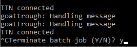
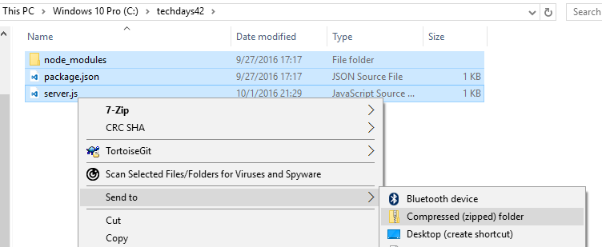

# The Things Network & Azure IoT in unison
## Deploying The Things Network Bridge to Azure

Remember creating the TTN bridge locally on your computer? Will it be always on? Most likely not, therefor it seems reasonable to deploy the TTN bridge in the Azure cloud.

### Prerequisits

1. A TTN bridge deployed/running on your computer _(like the one created earlier in the workshop)_

### Deploy Azure WebJob

Follow these steps to deploy an Azure WebJob using Node.js that runs the integration between The Things Network and Azure IoT Hub.

1. If the bridge is still running, stop the running bridge with `ctrl c` and confirm the cancelation of the process with `Y`.
    
    

2. Open a File Explorer and browse to the directory `c:\techdays42`.
3. Compress all files (including the `node_modules` folder) in `c:\techdays42` as ZIP file
    
    

4. Open the [Azure Portal](https://portal.azure.com) in a browser, log on and create a new **Web App**
5. Under **Settings**, go to **WebJobs** and click **Add**
6. Enter a name, e.g. **bridge**
7. Select your ZIP file as file to upload
8. Ensure that the type is set to **Continuous**
9. Set the scale to **Single Instance**
10. Click **OK** to deploy the WebJob
11. Once deployed, select the WebJob and click **Logs** to verify that the bridge works. This is example output:
```
[06/14/2016 16:27:47 > 996af8: INFO] TTN connected
[06/14/2016 16:28:07 > 996af8: INFO] 0004A30B001B442B: Handling uplink
[06/14/2016 16:28:10 > 996af8: INFO] Uplink { devEUI: '0004A30B001B442B',
[06/14/2016 16:28:10 > 996af8: INFO]   message: '{"lux":1000,"temperature":19.82,"deviceId":"0004A30B001B442B","time":"2016-06-14T16:28:06.766772461Z"}' }
[06/14/2016 16:28:29 > 996af8: INFO] 0004A30B001B442B: Handling uplink
[06/14/2016 16:28:29 > 996af8: INFO] Uplink { devEUI: '0004A30B001B442B',
[06/14/2016 16:28:29 > 996af8: INFO]   message: '{"lux":1000,"temperature":19.82,"deviceId":"0004A30B001B442B","time":"2016-06-14T16:28:28.908965124Z"}' }
```

You have now deployed the whole upstream to the Azure cloud. You have succesfully acomplished all available steps of this workshop.

