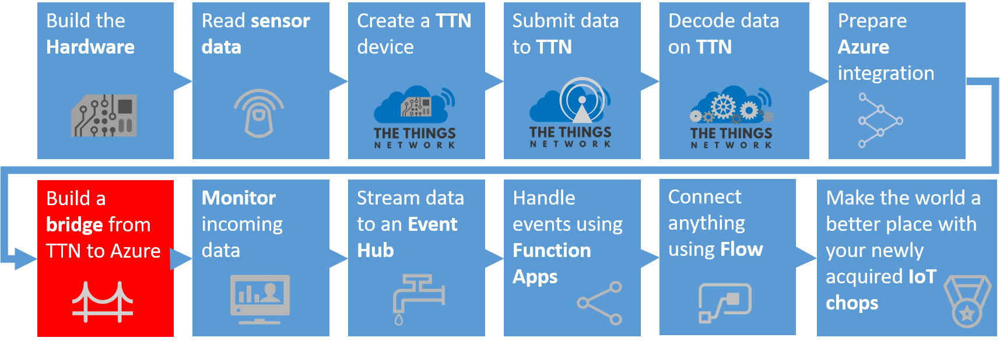
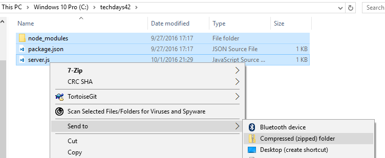
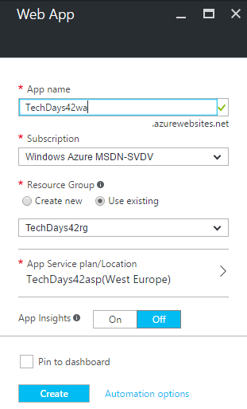
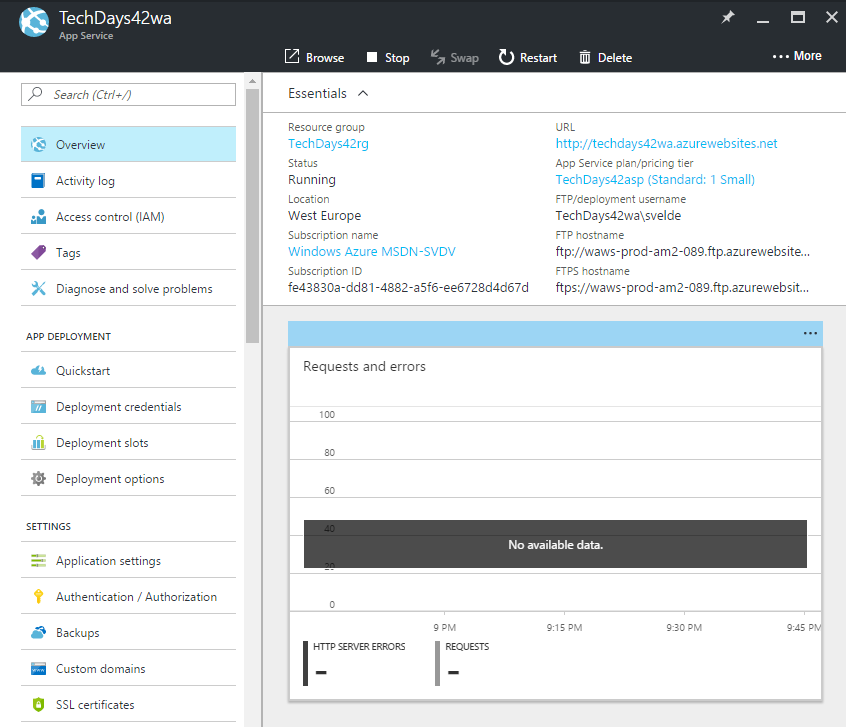
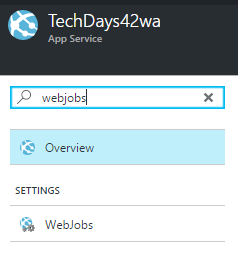
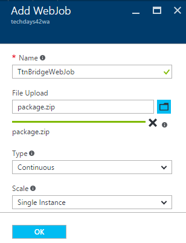
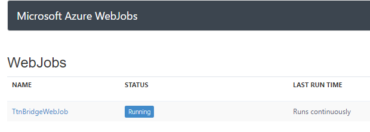
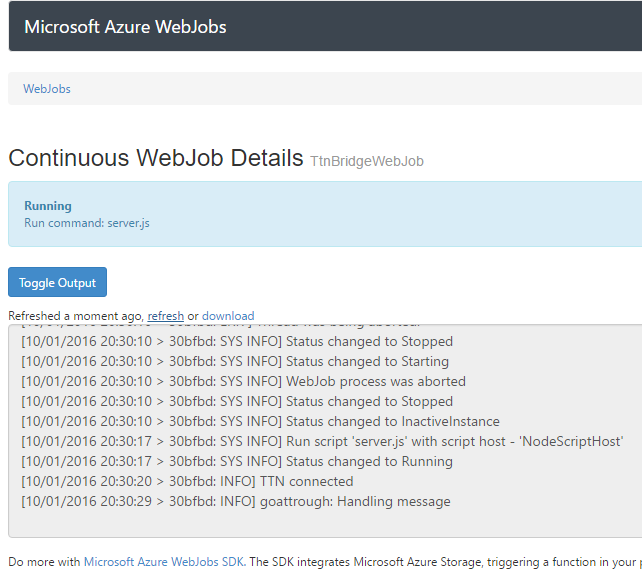

# The Things Network & Azure IoT in unison
## Deploying The Things Network Bridge to Azure

Remember creating the TTN bridge locally on your computer? Will it be always on? Most likely not, therefore it seems reasonable to deploy the TTN bridge in the Azure cloud.

### Prerequisites

1. A TTN bridge deployed/running on your computer _(like the one created earlier in the workshop)_

### Make the bridge ready for transport

Follow these steps to make the bridge ready to be deployed to Azure.

1. If the bridge is still running, stop the running bridge with `ctrl c` and confirm the cancellation of the process with `Y`.
    
    

2. Open a File Explorer and browse to the directory `c:\techdays42`.
3. Compress all files (including the `node_modules` folder) in `c:\techdays42` as ZIP file
    
    

### Deploy Azure WebJob

Follow these steps to deploy an Azure WebJob using Node.js that runs the integration between The Things Network and Azure IoT Hub.

1. `Log into` the [Azure portal](https://portal.azure.com/). You will be asked to provide Azure credentials if needed
2. On the left, select `Resource groups`. A list of resource groups is shown

    

3. Select the ResourceGroup `TechDays42rg`. It will open a new blade with all resources in this group

4. Select `Add`. A list of available services appears

    

5. Filter it with `web app` and select `Web App`

    

6. An introduction will be shown. Select `Create`
7. A dialog for the new Web App is shown
8. Enter a unique Web App name eg. `TechDays42wa`. A green sign will be shown if the name is unique
9. The Resource Group eg. TechDays42rg is already filled in
10. The App Service plan blade eg. TechDays42asp is already filled in 

    

11. Select `Create`

12. Creating a Web App will take some time, but we want to complete this step
13. So navigate back to the resource group (repeat step 1 and 2) and check the Web app creation in the resource group
14. If the Web App becomes listed, select `TechDays42wa`. Otherwise, 'refresh' the list a few times

    

15. You are now in the Web App blade. It should be shown like this, with all information available (otherwise, refresh a few times):

    

16. A Web App has dozens of settings. Filter the settings for `webjobs`

    

17. Select `WebJobs`. An empty list is presented
18. Select `Add`

    

19. Enter a unique Web App name eg. `TtnBridgeWebJob`. A green sign will be shown if the name is unique
20. Select 'your ZIP file` as file to upload
21. Ensure that the type is set to `Continuous`
22. Set the scale to `Single Instance`

    

23. Select `Ok`
24. The Web Job will be created. And it is listed on the page of the Web App

    

24. Let's check the state of the Web Job. Select `Logs`

    

25. A new page is shown, here the status of the Web Job is shown. The status is 'Running'

    

26. Go to the detail logging, selecting `the link` of the Web Job details. The TTN messages are handled 

    

You have now deployed the whole upstream to the Azure cloud. You have successfully accomplished all available steps of this workshop.

